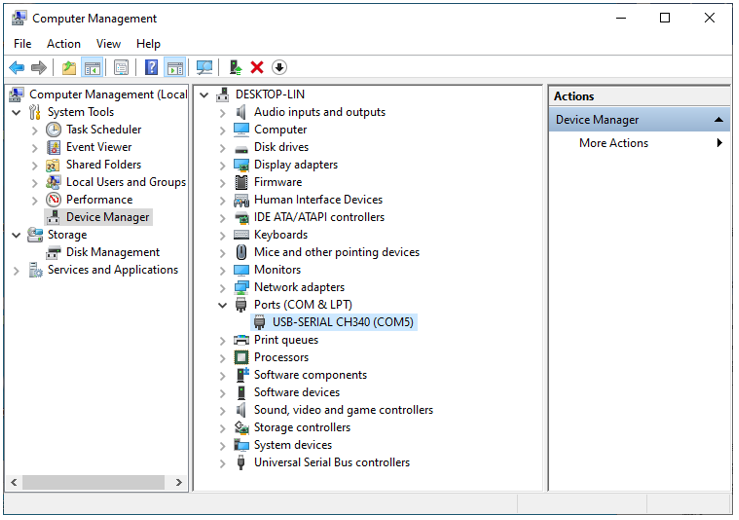
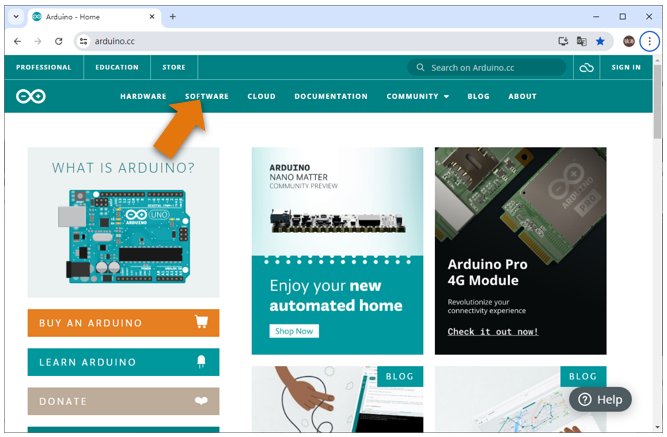
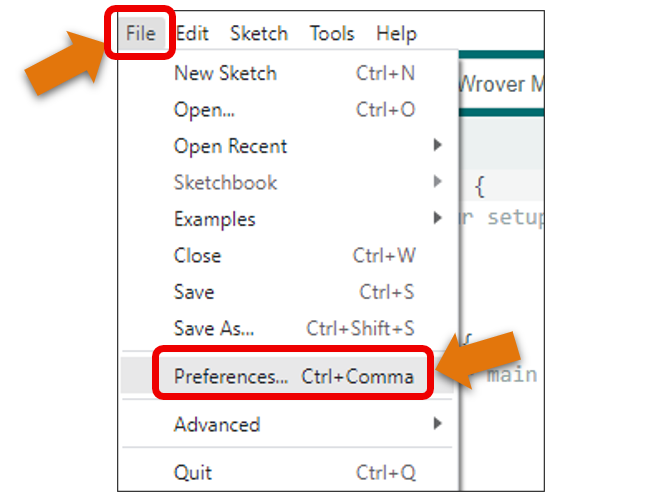
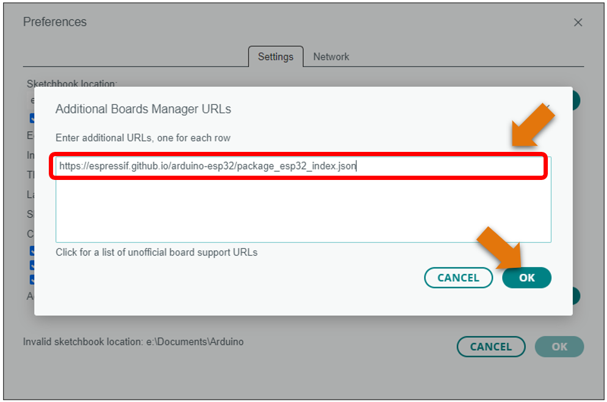
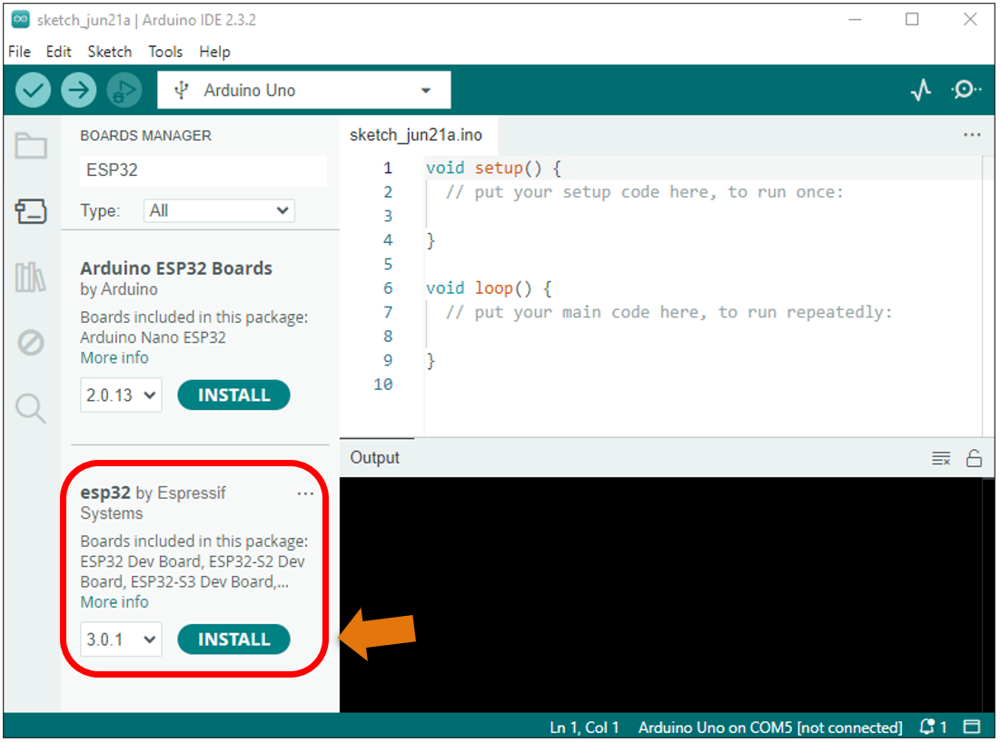
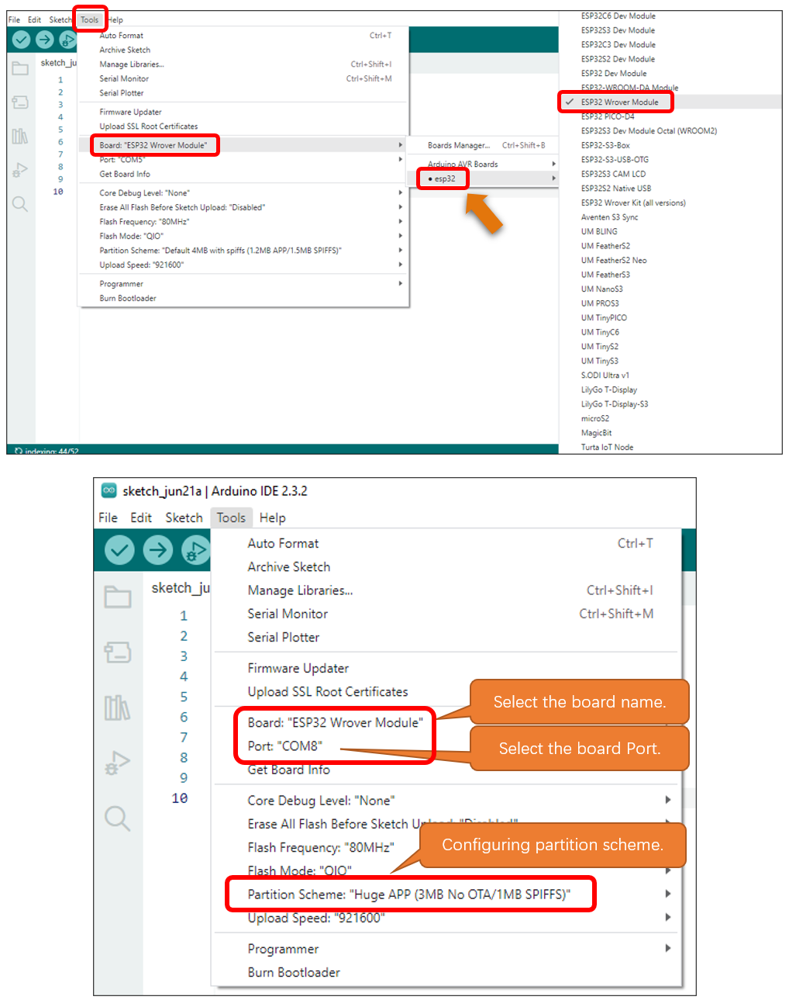
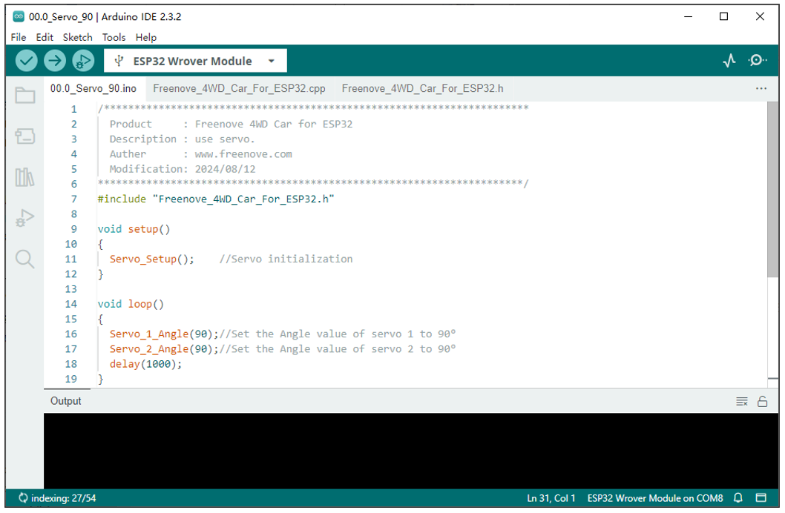
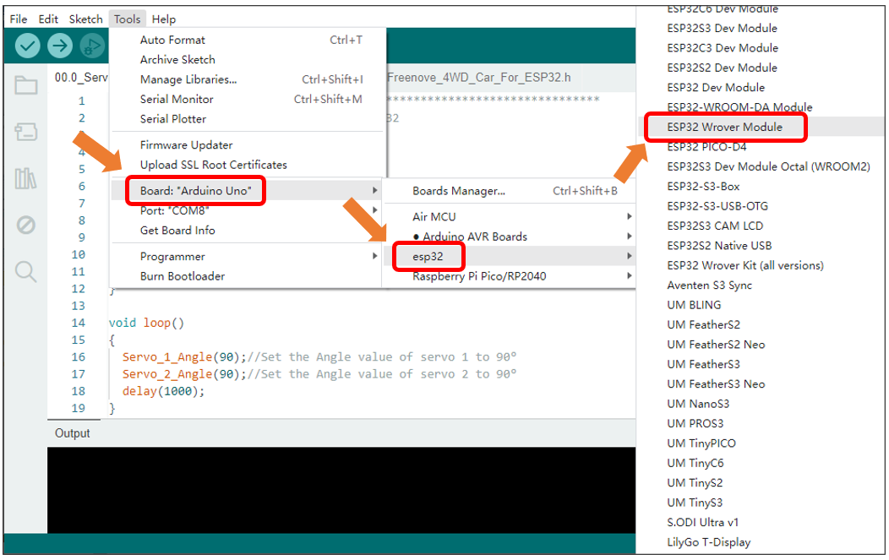
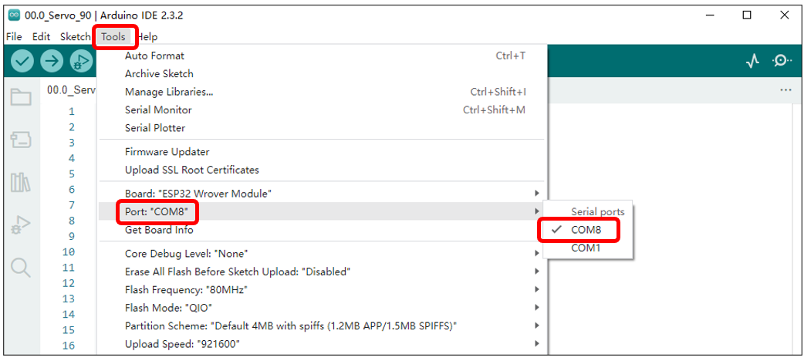

##############################################################################
Chapter 0 Installation of Arduino IDE 
##############################################################################

CH340 (Importance)
***************************

ESP32 uses CH340 to download codes. So before using it, we need to install CH340 driver in our computers.

Windows
===========================

Check whether CH340 has been installed
-------------------------------------------

1.	Connect your computer and ESP32 with a USB cable.

2.	Turn to the main interface of your computer, select “This PC” and right-click to select “Manage”.

3.	Click “Device Manager”. If your computer has installed CH340, you can see“USB-SERIAL CH340 (COMx)”. And you can click here to move to the next step.

Installing CH340
---------------------------------------------

1.	First, download CH340 driver, click http://www.wch-ic.com/search?q=CH340&t=downloads to download the appropriate one based on your operating system.

If you would not like to download the installation package, you can open **“Freenove_Ultimate_Starter_Kit_for_ESP32/CH340”**, we have prepared the installation package.

2.	Open the folder “Freenove_Ultimate_Starter_Kit_for_ESP32/CH340/Windows/”

3.	Double click “CH341SER.EXE”.

4.	Click “INSTALL” and wait for the installation to complete.

5.	Install successfully. Close all interfaces.

6.	When ESP32 is connected to computer, select “This PC”, right-click to select “Manage” and click “Device Manager” in the newly pop-up dialog box, and you can see the following interface.

7.	So far, CH340 has been installed successfully. Close all dialog boxes. 

MAC
=========================================

First, download CH340 driver, click http://www.wch-ic.com/search?q=CH340&t=downloads to download the appropriate one based on your operating system.

If you would not like to download the installation package, you can open **“Freenove_Ultimate_Starter_Kit_for_ESP32/CH340”** , we have prepared the installation package.

Second, open the folder **“Freenove_Ultimate_Starter_Kit_for_ESP32/CH340/MAC/”**

Third, click Continue.

Fourth, click Install.

Then, waiting Finsh.

Finally, restart your PC.

If you still haven't installed the CH340 by following the steps above, you can view readme.pdf to install it.

Arduino Software
******************************************

Arduino Software (IDE) is used to write and upload the code for Arduino Board.

First, install Arduino Software (IDE): visit https://www.arduino.cc, click "Download" to enter the download page.

Select and download corresponding installer according to your operating system. If you are a windows user, please select the "Windows Installer" to download to install the driver correctly.

After the download completes, run the installer. For Windows users, there may pop up an installation dialog box of driver during the installation process. When it popes up, please allow the installation.

After installation is completed, an Arduino Software shortcut will be generated in the desktop. Run the Arduino Software.

The interface of Arduino Software is as follows:

Programs written with Arduino Software (IDE) are called sketches. These sketches are written in the text editor and saved with the file extension.ino. The editor has features for cutting/pasting and searching/replacing text. The message area gives feedback while saving and exporting and also displays errors. The console displays text output by the Arduino Software (IDE), including complete error messages and other information. The bottom right-hand corner of the window displays the configured board and serial port. The toolbar buttons allow you to verify and upload programs, create, open, and save sketches, and open the serial monitor.

Additional commands are found within the five menus: File, Edit, Sketch, Tools, Help. The menus are context sensitive, which means only those items relevant to the work currently being carried out are available.

Environment Configuration
***************************************

First, open the software platform arduino, and then click File in Menus and select Preferences.

Second, click on the symbol behind "Additional Boards Manager URLs" 

Third, fill in https://espressif.github.io/arduino-esp32/package_esp32_index.json in the new window, click OK, and click OK on the Preferences window again.

Fourth, click "BOARDS MANAGER" on the left and type "ESP32" in the search box.

Fifth, select Espressif Systems' ESP32 and select version 3.0.x. Click "INSTALL" to install esp32.

.. note::
    
    **it takes a while to install the ESP32, make sure your network is stable.**

When finishing installation, click Tools in the Menus again and select Board: "Arduino Uno", and then you can see information of ESP32 Wrover Module. Click " ESP32 Wrover Module" so that the ESP32 programming development environment is configured.

Uploading the First Code
*************************************

Here we use “00.0_Servo_90” in “Freenove_4WD_Car_Kit_for_ESP32\\Sketches” as an example.

The servo on the car is controlled by PCA9685. Therefore, it is necessary to add the related libararies to Arduino IDE.

How to Add libraries 
=====================================

We prefer to use method 2 to install libs.

Method 1
----------------------------------------

Open Arduino IDE, click Sketch on Menu bar, move your mouse to Include Library and then click Manage Libraries. 

.. image:: ../_static/imgs/0_Installation_of_Arduino_IDE_/Chapter00_28.png
    :align: center

There is an input field on the right top of the pop-up window. Enter PCA9685 there and click to install the library boxed in the following picture.

Wait for the installation to finish.

Method 2
----------------------------------------

Open Arduino IDE, click Sketch on Menu bar, move your mouse to Include Library and then click Add .ZIP library. 

On the pop-up window, select PCA9685.zip of Libraries folder in **“Freenove_4WD_Car_Kit_for_ESP32\\Libraries”**, and then click Open.

How to compile and upload code
=================================

Step 1. Connect your computer and ESP32 with a USB cable.

Step 2. Open “00.0_Servo_90” folder in **“Freenove_4WD_Car_Kit_for_ESP32\\Sketches”**, double-click “00.0_Servo_90.ino”. The code is to rotate the two servo motors to 90°.

Step 3. Select development board.

Click Tolls on Menu bar, move your mouse to Board: “Arduino Uno”, select ESP32 Arduino and then select ESP32 Wrover Module.

Step 4. Select serial port.

Cilick Tools on Menu bar, move your mouse to Port and select COMx on your computer. The value of COMx varies in different computers, but it won’t affect the download function of ESP32, as long as you select the correct one.

Click “Upload” and the program will be downloaded to ESP32.

When you see the following content, it indicates that the program has been uploaded to ESP32.

Note: For macOS users, if the uploading fails, please set the baud rate to 115200 before clicking “Upload Using Programmer”.

The car needs to be installed with batteries. When installing them, please following the silk print on the board.

Plug the ESP32 to the car shield. Pay attention to the orientation of ESP32. 

Make sure ESP32 is plugged into the shield correctly. Take out two servo motors and plug them into the car shield. Please note the color of the wires Do NOT connect them wrongly. 

Turn ON the switch and the two servos will keep at 90°.