##############################################################################
Chapter 1 Assembling Smart Car
##############################################################################

If you have any concerns, please feel free to contact us via support@freenove.com

Assembling the Car
**************************************

Installing Motor and Wheels
========================================

There is a special fixed bracket to fix motor, which contains an aluminum bracket, two M3*30 screws, two M3*8 screws, and two M3 nuts, as shown below:

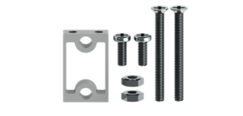

Installation steps:

.. table::
    :align: center
    :class: table-line
    :width: 80%
    
    +------------------------------------------------------------------------------------------------------------------+
    | Step 1 Install servos to fix the bracket on the shield.                                                          |
    |                                                                                                                  |
    | |Chapter01_01|                                                                                                   |
    |                                                                                                                  |
    | Put the bottom of the car up, use two M3*8 screws to fix the bracket on the shield.                              |
    +------------------------------------------------------------------------------------------------------------------+
    | Step 2 Install the motor to the bracket.                                                                         |
    |                                                                                                                  |
    | |Chapter01_02|                                                                                                   |
    |                                                                                                                  |
    | Use two M3*30 screws and two M3 nuts to fix the motor on the bracket                                             |
    +------------------------------------------------------------------------------------------------------------------+
    | Step 3 Connect the motor wire to the corresponding terminal.                                                     |
    |                                                                                                                  |
    | |Chapter01_03|                                                                                                   |
    |                                                                                                                  |
    | Pass the motor wire through the wire hole of the shield and connect it to the motor interface on the top.        |
    +------------------------------------------------------------------------------------------------------------------+
    | Step 4 Install the wheel to the motor.                                                                           |
    |                                                                                                                  |
    | |Chapter01_04|                                                                                                   |
    |                                                                                                                  |
    | Note: The hole is not circle. Please align the hole and fix the wheel to the motor.                              |
    +------------------------------------------------------------------------------------------------------------------+
    | |Chapter01_05|                                                                                                   |
    |                                                                                                                  |
    | The installation of the four wheels is similar. Repeat the above installation steps to complete the installation |
    +------------------------------------------------------------------------------------------------------------------+

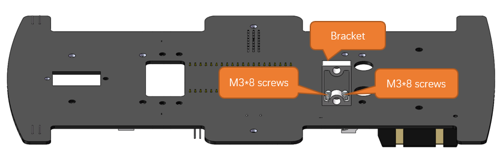
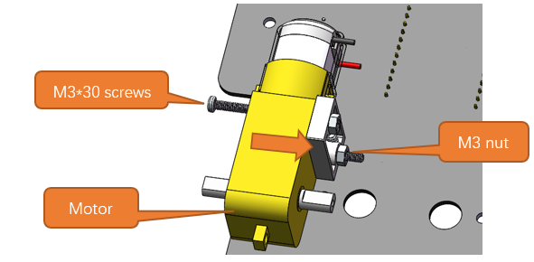
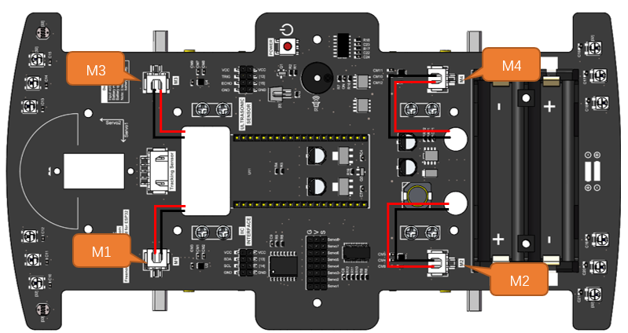
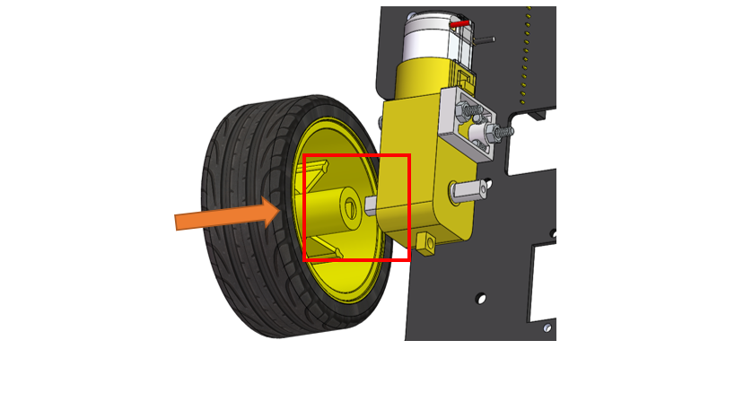
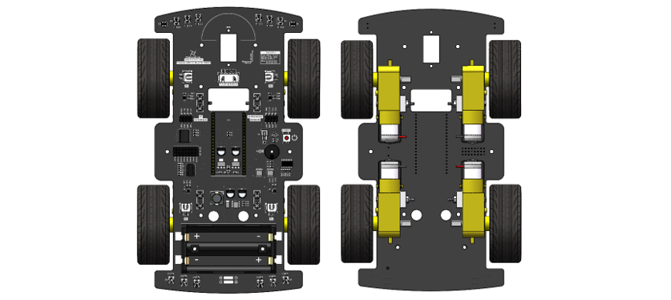

Installing ESP32
=======================

.. table::
    :align: center
    :class: table-line
    :width: 80%
    
    +-------------------------------------------------------------------------------------------------------+
    | Step: Plug ESP32-Wrover-Dev in the shield.                                                            |
    |                                                                                                       |
    | |Chapter01_06|                                                                                        |
    |                                                                                                       |
    | Please pay attention to the orientation of ESP32. Do NOT reverse it, otherwise it may burn the ESP32. |
    +-------------------------------------------------------------------------------------------------------+

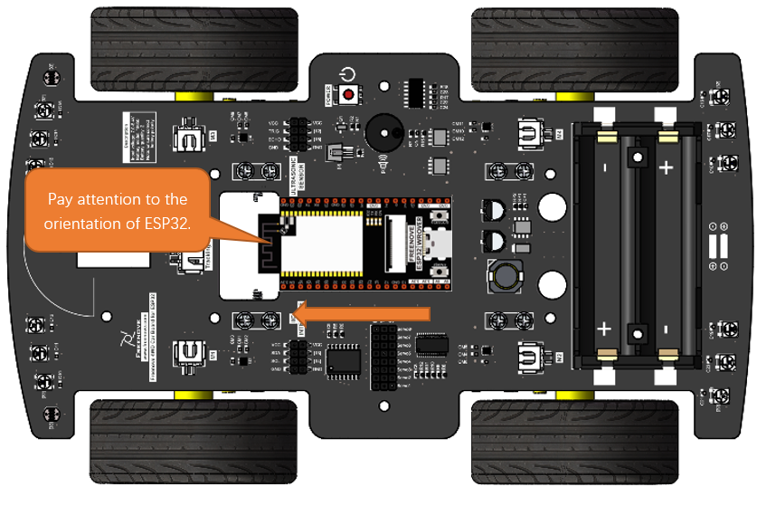

Installing Servo
======================

Servo package: one servo, three rocker arms, two M2*8 screws and one M2*4 screw. 

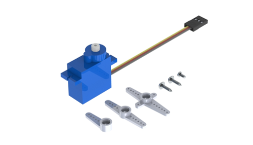

.. table::
    :align: center
    :class: table-line
    :width: 80%
    
    +------------------------------------------------------------------------------------------------------+
    | Step 1 Fix servo1 to the shield.                                                                     |
    |                                                                                                      |
    | |Chapter01_08|                                                                                       |
    |                                                                                                      |
    | Use two M2*16 screws and two M2 nuts to fix the servo1 on the shield.                                |
    |                                                                                                      |
    | Pay attention to the servo's direction.                                                              |
    +------------------------------------------------------------------------------------------------------+
    | Step 2 Fix two acrylics of the Pan-tilt together.                                                    |
    |                                                                                                      |
    | |Chapter01_09|                                                                                       |
    |                                                                                                      |
    | Use a M2*16 screw and a M2 nut to fix two acrylics of the Pan-tilt together.                         |
    +------------------------------------------------------------------------------------------------------+
    | Step 3 Fix the Pan-tilt to servo1.                                                                   |
    |                                                                                                      |
    | |Chapter01_10|                                                                                       |
    |                                                                                                      |
    | Use two M2.5*8 screws to fix the pan-tilt to rocker arm and a M2*4 to fix the rocker arm to servor1. |
    |                                                                                                      |
    | Note: Before fixing the rocker arm to servo1, please adjust the servo at 90°.You can refer to here.  |
    +------------------------------------------------------------------------------------------------------+
    | Step 4 Fix servo2 to Pan-tilt.                                                                       |
    |                                                                                                      |
    | |Chapter01_11|                                                                                       |
    |                                                                                                      |
    | Use two M2*16 screws and two M2 nuts to fix servo2 to Pan-tilt.                                      |
    +------------------------------------------------------------------------------------------------------+
    | Step 5 Wiring of the servor motor                                                                    |
    |                                                                                                      |
    | |Chapter01_12|                                                                                       |
    |                                                                                                      |
    | Connect servo1 and servo 2 to Servo1 and Servo2 interfaces on the shield respectively.               |
    |                                                                                                      |
    | Pay attention to the color of the wires. Do not connect them wrongly.                                |
    +------------------------------------------------------------------------------------------------------+

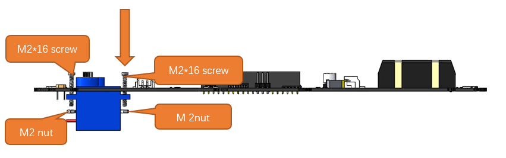

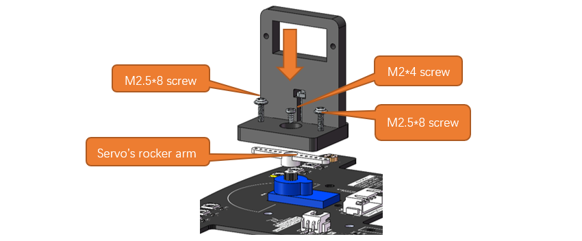
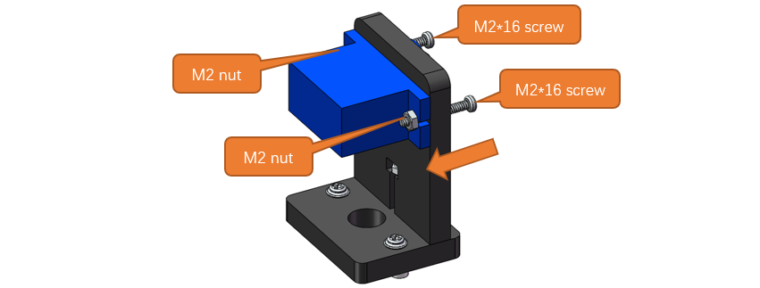
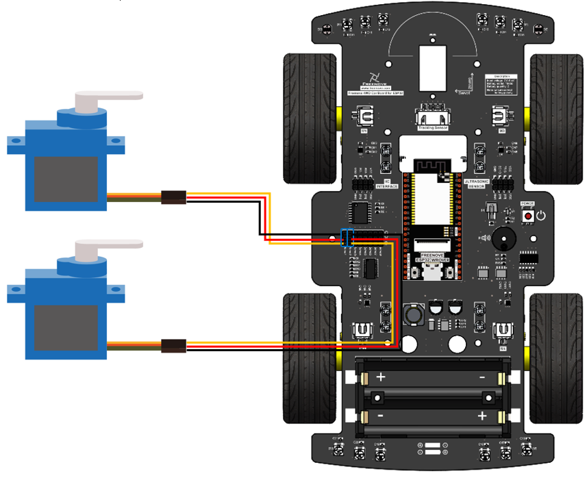

Assembling LED Matrix Pan-tilt.
=====================================================

Acrylic parts of the Pan-tilt are as follows:

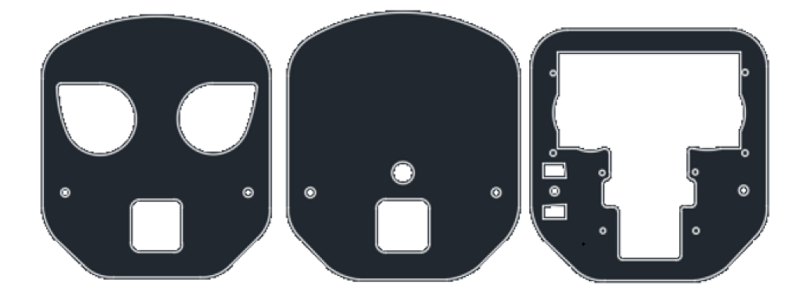

Installation steps: (:combo:`red font-bolder:Note: Do not disorder Servo1 and Servo2 during the installation.`)

.. table::
    :align: center
    :class: table-line
    :width: 80%
    
    +------------------------------------------------------------------------------------------+
    | Step 1                                                                                   |
    |                                                                                          |
    | Remove the camera from the ESP32.                                                        |
    |                                                                                          |
    | |Chapter01_14|                                                                           |
    |                                                                                          |
    | There are 2 types of head acrylics.                                                      |
    |                                                                                          |
    | One of these is shown here, and the other installation steps are the same.               |
    |                                                                                          |
    | Note: The connector and the ESP32 are flip-top type, please do not install it violently. |
    +------------------------------------------------------------------------------------------+
    | Step 2                                                                                   |
    |                                                                                          |
    | |Chapter01_15|                                                                           |
    |                                                                                          |
    | Use four M1.4*6 screws to fix the camera connector to the Pan-tilt.                      |
    +------------------------------------------------------------------------------------------+
    | Step 3                                                                                   |
    |                                                                                          |
    | |Chapter01_16|                                                                           |
    |                                                                                          |
    | Use four M1.4*6 screws to fix the LED matrix to the Pan-tilt.                            |
    +------------------------------------------------------------------------------------------+
    | Step 4                                                                                   |
    |                                                                                          |
    | |Chapter01_17|                                                                           |
    |                                                                                          |
    | Between two acrylic plates, use two M3 nuts as washers.                                  |
    +------------------------------------------------------------------------------------------+
    | Step 5                                                                                   |
    |                                                                                          |
    | |Chapter01_18|                                                                           |
    |                                                                                          |
    | Use a M2*16 screw and a M2 nut to fix the two acrylics.                                  |
    +------------------------------------------------------------------------------------------+
    | Step 6                                                                                   |
    |                                                                                          |
    | |Chapter01_19|                                                                           |
    |                                                                                          |
    | Use a M2*16 screw and a M2 nut to fix the two acrylic parts.                             |
    +------------------------------------------------------------------------------------------+
    | Step 7                                                                                   |
    |                                                                                          |
    | |Chapter01_20|                                                                           |
    |                                                                                          |
    | Use two M2.5*8 screws to fix the rocker arm to acrylic part.                             |
    +------------------------------------------------------------------------------------------+
    | Step 8                                                                                   |
    |                                                                                          |
    | |Chapter01_21|                                                                           |
    |                                                                                          |
    | Use a M2*4 screws to fix the ultrasonic pan-tilt to servor2.                             |
    |                                                                                          |
    | Note: Before fixing the rocker arm to servo2, please adjust the servo at 90°.            |
    +------------------------------------------------------------------------------------------+
    | After finished                                                                           |
    |                                                                                          |
    | |Chapter01_22|                                                                           |
    +------------------------------------------------------------------------------------------+

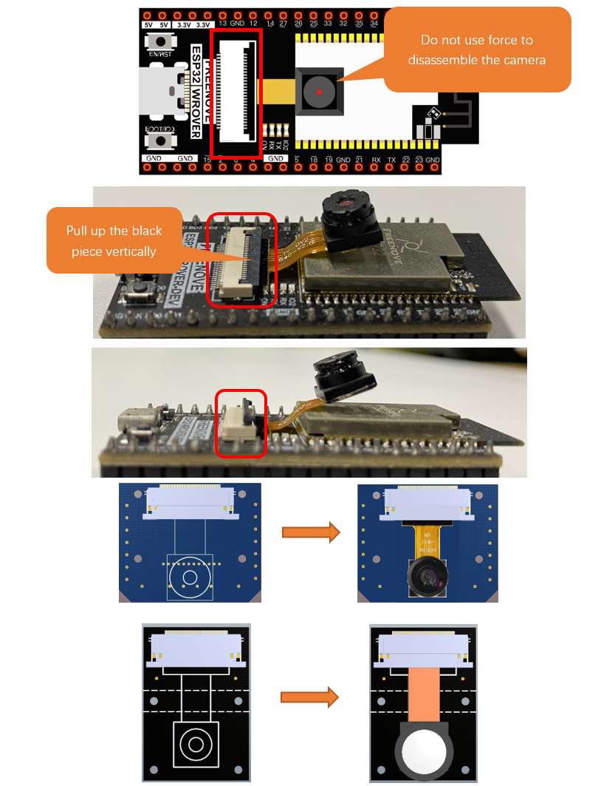

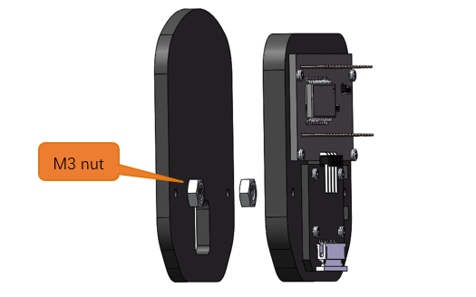
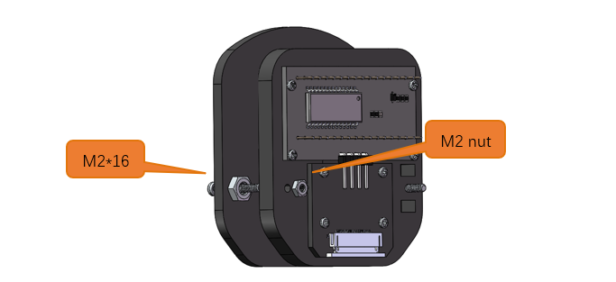
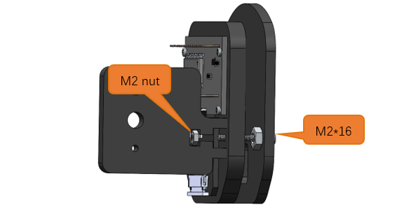
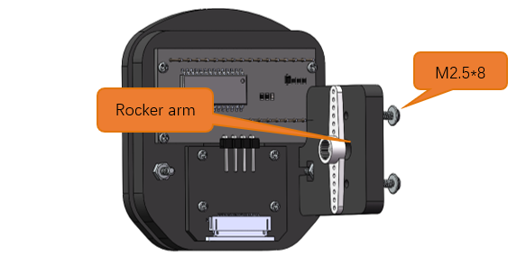
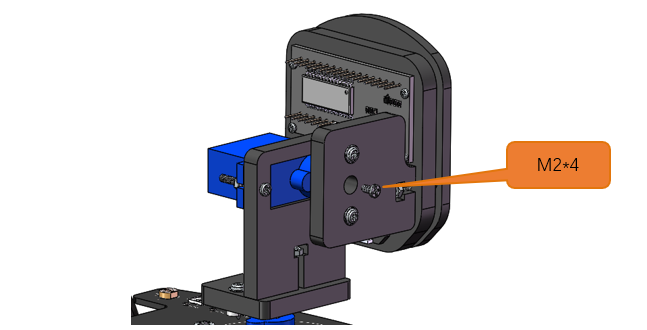
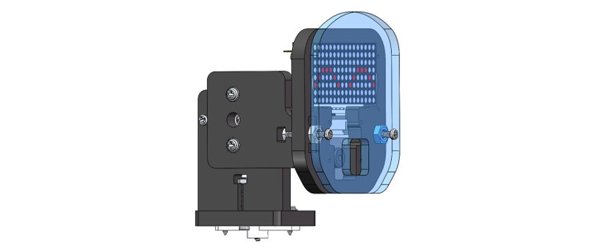

Installing Line Tracking Module
=================================

.. table::
    :align: center
    :class: table-line
    :width: 80%
    
    +--------------------------------------------------------------------------------+
    | Step 1 Installing line tracking module                                         |
    |                                                                                |
    | |Chapter01_23|                                                                 |
    |                                                                                |
    | First, use two M3*6 screws to fix two M3*28 standoff to the bottom of the car, |
    |                                                                                |
    | and then use two M3*6 screws to fix the line tracking module to standoff.      |
    +--------------------------------------------------------------------------------+
    | Step 2 Connect the cable to the tracking module                                |
    |                                                                                |
    | |Chapter01_24|                                                                 |
    |                                                                                |
    | Use cable to connect the two connectors marked above.                          |
    +--------------------------------------------------------------------------------+

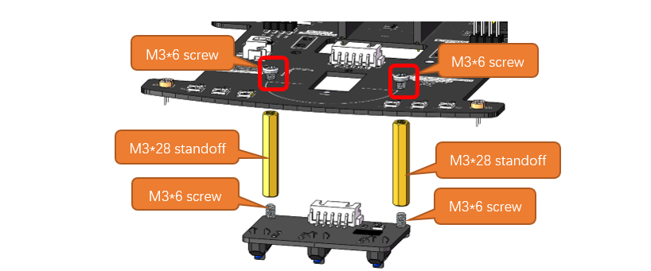
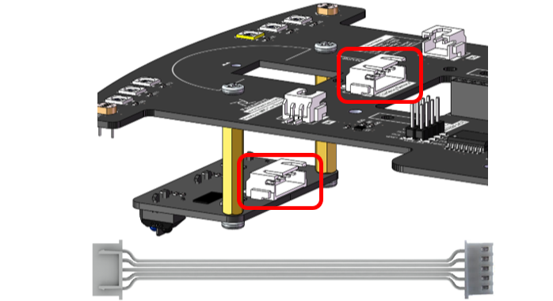

Wiring of Head
=================================

.. table::
    :align: center
    :class: table-line
    :width: 80%
    
    +--------------------------------------------------------------------------+
    | Step 1                                                                   |
    |                                                                          |
    | |Chapter01_25|                                                           |
    |                                                                          |
    | Turn up the FPC connector.                                               |
    +--------------------------------------------------------------------------+
    | Step 2                                                                   |
    |                                                                          |
    | |Chapter01_26|                                                           |
    |                                                                          |
    | Make sure that the blue side is upwards and the metal side is downwards. |
    |                                                                          |
    | Do NOT connect it reversely.                                             |
    +--------------------------------------------------------------------------+
    | Step 3                                                                   |
    |                                                                          |
    | |Chapter01_27|                                                           |
    |                                                                          |
    | Make sure that the blue side is upwards and the metal side is downwards. |
    |                                                                          |
    | Do NOT connect it reversely.                                             |
    |                                                                          |
    | Please make sure that FPC Wire can pass through the acrylic sheet.       |
    |                                                                          |
    | (Refer to the “Installing the Acrylic Parts-Step 3”)                     |
    +--------------------------------------------------------------------------+
    | Step 4                                                                   |
    |                                                                          |
    | |Chapter01_28|                                                           |
    |                                                                          |
    | According to the prompts on the module and the car,                      |
    |                                                                          |
    | use the 4P cable to connect the LED matrix module and the car.           |
    |                                                                          |
    | Please note that the order of the lines cannot be connected wrongly.     |
    +--------------------------------------------------------------------------+

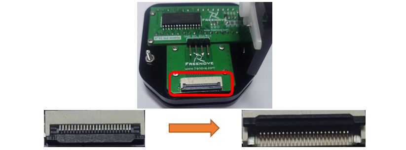
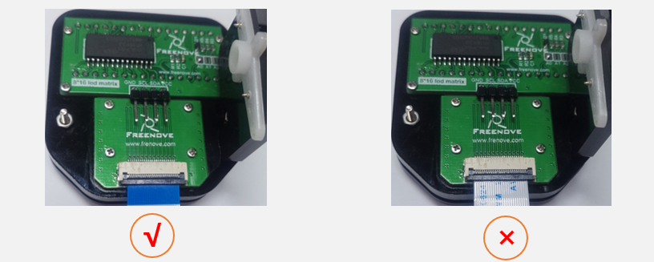

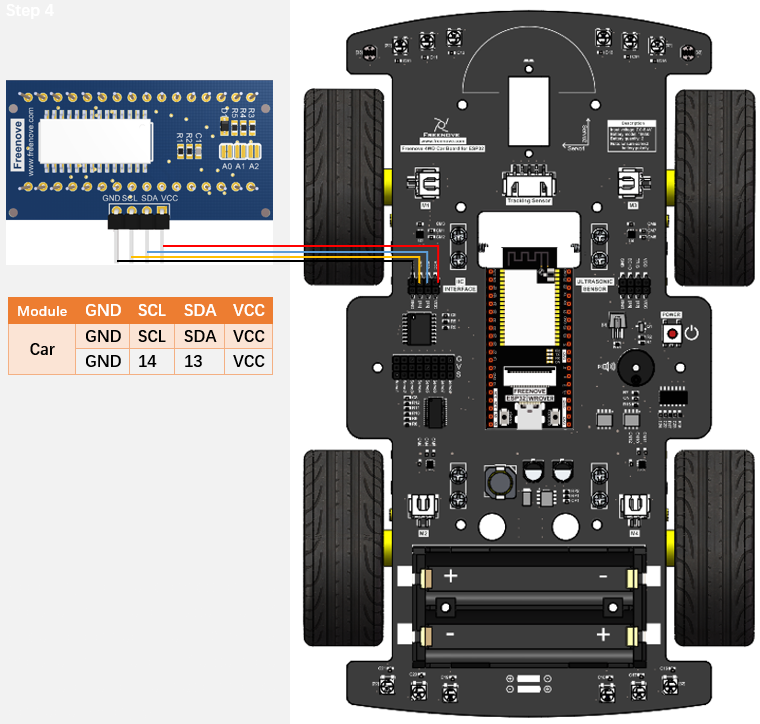

Installing the Acrylic Parts
==============================

.. table::
    :align: center
    :class: table-line
    :width: 80%
    
    +------------------------------------------------------------------------+
    | Step 1                                                                 |
    |                                                                        |
    | |Chapter01_29|                                                         |
    |                                                                        |
    | Pass four M3*6 screws upward from the bottom of the shield.            |
    +------------------------------------------------------------------------+
    | Step 2                                                                 |
    |                                                                        |
    | |Chapter01_30|                                                         |
    |                                                                        |
    | Fix 4 M3*28 standoffs to M3*6 screws.                                  |
    +------------------------------------------------------------------------+
    | Step 3                                                                 |
    |                                                                        |
    | |Chapter01_31|                                                         |
    |                                                                        |
    | Align the acrylic part with the mounting hole of the standoffs,        |
    |                                                                        |
    | and use four M3*6 screws to fix the acrylic on the standoffs.          |
    |                                                                        |
    | **Please make sure that FPC Wire can pass through the acrylic sheet.** |
    +------------------------------------------------------------------------+

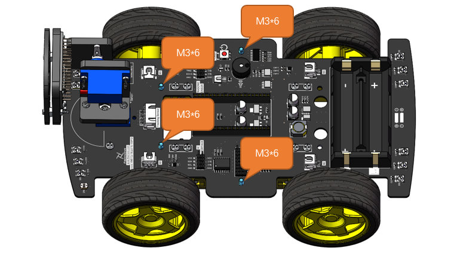
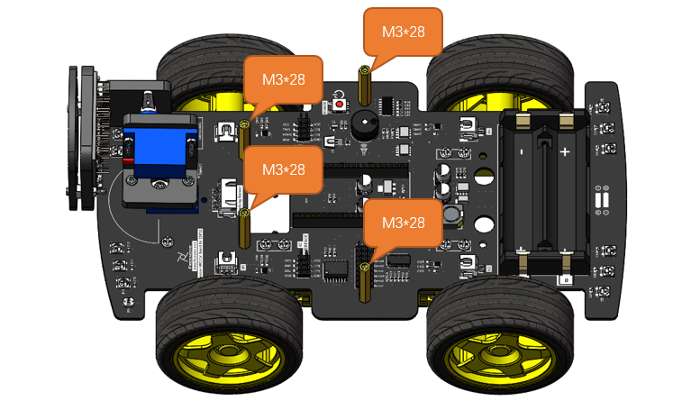
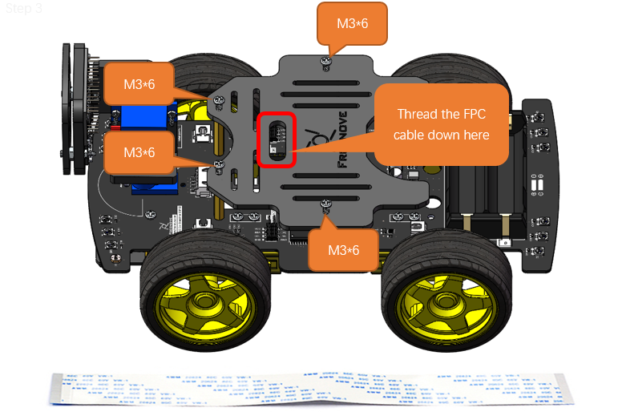

How to Play
*****************************

Add libraries
==============================

Open the Arduino IDE, Click Sketch on the menu bar, select Include Library, click Add .ZIP Library...

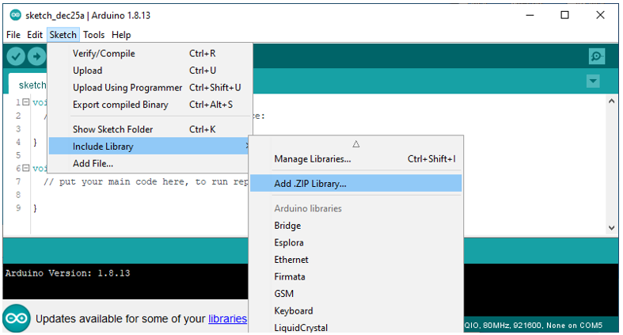

In the new pop-up window, select Freenove_4WD_Car_Kit_for_ESP32\\Libraries, select every Library, click Open, and repeat this process several times until you have installed all six Libraries into the Arduino.

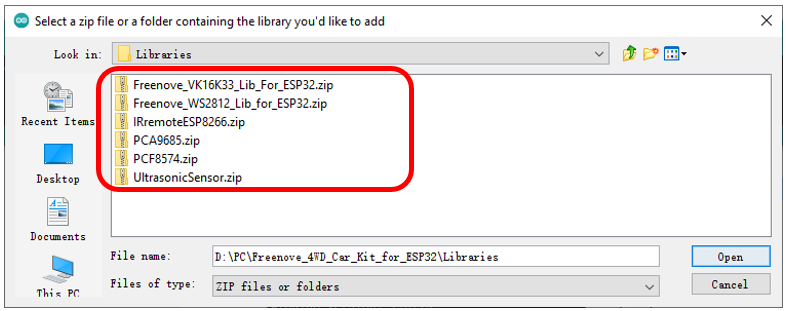

IR remote control
==============================

Step 1 Upload Code 
------------------------------

Connect your computer and ESP32 with a USB cable.

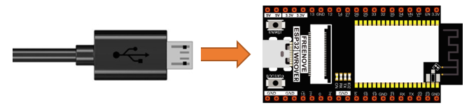

Open the folder Freenove_4WD_Car_Kit_for_ESP32\\Sketches\\05.3_Multi_Functional_Car.

Double-click to open the 05.3_Multi_Functional_Car.ino.

Click **Upload**.

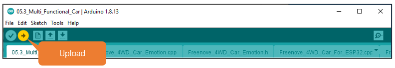

In this tutorial, if you find that the car is moving in the opposite direction as expected, such as backward when it should be moving forward. The car turned right when it should have turned left. Then you can modify the file which named **“Freenove_4WD_Car_For_ESP32.h”** to change the value as commented.

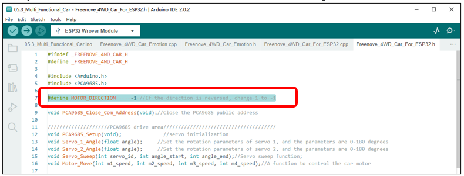

Step 2 Control the Car
---------------------------

After the code is successfully uploaded, turn on the power of the car and use the infrared remote control to

control the car and other functions. The corresponding keys and their functions are shown in the following

table:

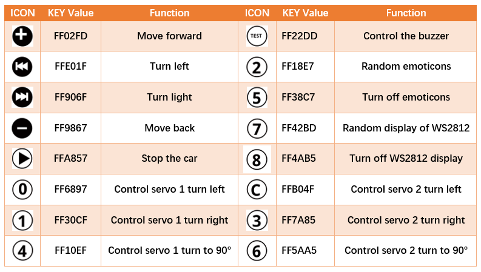