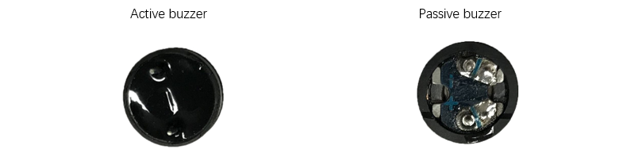
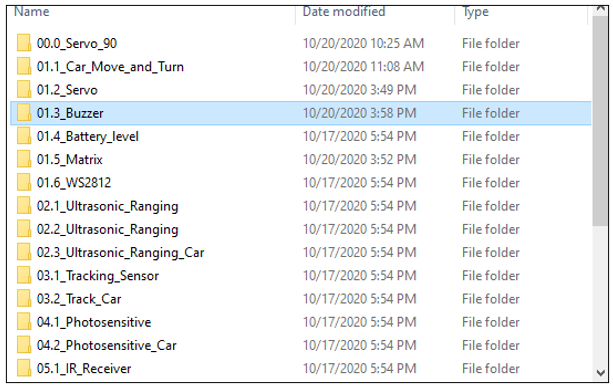
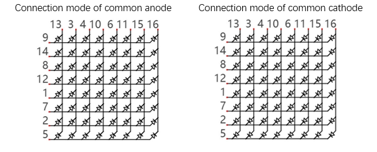
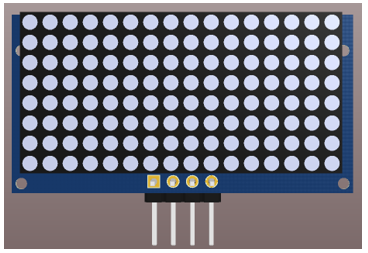

##############################################################################
Chapter 2 Module test 
##############################################################################

If you have any concerns, please feel free to contact us via support@freenove.com

2.1 Motor
**************************************

Motor
===================================

A motor is a device that converts electrical energy into mechanical energy. Motor consists of two parts: stator and rotor. When motor works, the stationary part is stator, and the rotating part is rotor. Stator is usually the outer case of motor, and it has terminals to connect to the power. Rotor is usually the shaft of motor, and can drive other mechanical devices to run. Diagram below is a small DC motor with two pins.

When a motor gets connected to the power supply, it will rotate in one direction. Reverse the polarity of power supply, then the motor rotates in opposite direction.

PWM
===================================

PWM, Pulse Width Modulation, uses digital pins to send certain frequencies of square waves, that is, the output of high levels and low levels, which alternately last for a while. The total time for each set of high levels and low levels is generally fixed, which is called the period (the reciprocal of the period is frequency). The time of high level outputs are generally called “pulse width”, and the duty cycle is the percentage of the ratio of pulse duration, or pulse width (PW) to the total period (T) of the waveform.

The longer the output of high levels last, the larger the duty cycle and the higher the corresponding voltage in analog signal will be. The following figures show how the analogs signal voltage vary between 0V-5V (high level is 5V) corresponding to the pulse width 0%-100%:

The longer the PWM duty cycle is, the higher the output power will be. Now that we understand this relationship, we can use PWM to control the brightness of an LED or the speed of DC motor and so on.

Schematic
===================================

For this tutorial, the driver chip of the car is controlled by the 8-15th output channels of the IIC chip PCA9685. When driving the motor, it is necessary to initialize the PCA9685 chip first, and then set the PWM value of the corresponding output channel to make its output voltage drive the motor.

As can be seen from the above figure, if we want to control the motor M1, we need to set the 14th and 15th channels of the PCA9685.

Similarly, to control the motor M2, we need to set the 8th and 9th channels of the PCA9685, to control the motor M3, we need to set the 12th and 13th channels of the PCA9685, and to control the motor M4, we need to set the 10th and 11th channels of the PCA9685.

+--------+--------+----------------------------------+
| Mx_IN1 | Mx_IN2 | Rotating direction of the wheels |
+--------+--------+----------------------------------+
| 1      | 0      | Forward                          |
+--------+--------+----------------------------------+
| 0      | 1      | backward                         |
+--------+--------+----------------------------------+

Sketch
=================================

Next we will download the code to ESP32 to test the motor. Open **“01.1_Car_Move_and_Turn”** folder in “Freenove_4WD_Car_Kit_for_ESP32\Sketches” and double-click “01.1_Car_Move_and_Turn.ino”.

In this tutorial, if you find that the car is moving in the opposite direction as expected, such as backward when it should be moving forward. The car turned right when it should have turned left. Then you can modify the file which named **“Freenove_4WD_Car_For_ESP32.h”** to change the value as commented.

Code
===================================

.. literalinclude:: ../../../freenove_Kit/Sketches/01.1_Car_Move_and_Turn/01.1_Car_Move_and_Turn.ino
    :linenos: 
    :language: c
    :dedent:

After downloading the code, please put the car to a relatively open area. Turn on the power switch and you can see the car go forward, backward, turn left and turn right repeatedly.

Code Explanation
===================================

If you are not familiar with Arduino IDE, you can visit https://www.arduino.cc/reference/en/ to learn more. 

Add the header file of the car. Each time before controlling the car, please add header file first.

.. code-block:: c
    :linenos:

    #include "Freenove_4WD_Car_For_ESP32.h"

Motor_Setup function, initialize the driver chip of the motor.

.. code-block:: c
    :linenos:

    PCA9685_Setup();         //Initialize PCA9685 to control Motor

Loop functopn can be used repeatedly in the program. Here we call Motor_Move function to control the car to move forward, backward, turn left and turn right repeatedly.

.. literalinclude:: ../../../freenove_Kit/Sketches/01.1_Car_Move_and_Turn/01.1_Car_Move_and_Turn.ino
    :linenos: 
    :language: c
    :lines: 13-32
    :dedent:

Motor_Move function is to control the car. The four parameters m1_speed, m2_speed, m3_speed, m4_speed range from -4095 to 4095. When the value is positive number, the motors move forward. Otherwise, they move backwards. m1_speed, m2_speed represent the two motors on the left and m3_speed, m4_speed embody those on the right. 

.. code-block:: c
    :linenos:

    void Motor_Move(int m1_speed, int m2_speed, int m3_speed, int m4_speed);

If you are not familiar with the position of the motors, you can click here to check the previous content.

2.2 Servo
**********************************

Servo
=================================

Servo is a compact package which consists of a DC motor, a set of reduction gears to provide torque, a sensor and control circuit board. Most servos only have a 180-degree range of motion via their “horn”. Servos can output higher torque than a simple DC motor alone and they are widely used to control motion in model cars, model airplanes, robots, etc. Servos have three wire leads which usually terminate to a male or female 3-pin plug. Two leads are for electric power: positive (2-VCC, Red wire), negative (3-GND, Brown wire), and the signal line (1-Signal, Orange wire), as represented in the Servo provided in your Kit.

We will use a 50Hz PWM signal with a duty cycle in a certain range to drive the Servo. The lasting time of 0.5ms-2.5ms of PWM single cycle high level corresponds to the servo angle 0 degrees - 180 degree linearly. Part of the corresponding values are as follows:

+-----------------+-------------+
| High level time | Servo angle |
+=================+=============+
| 0.5ms           | 0 degree    |
+-----------------+-------------+
| 1ms             | 45 degree   |
+-----------------+-------------+
| 1.5ms           | 0 degree    |
+-----------------+-------------+
| 2ms             | 45 degree   |
+-----------------+-------------+
| 2.5ms           | 180 degree  |
+-----------------+-------------+

When you change the servo signal value, the servo will rotate to the designated angle.

Schematic
==================================

For this tutorial, the driver chip of the servo is controlled by the 0-7th output channels of the IIC chip PCA9685. When driving the servos, it is necessary to initialize the PCA9685 chip first, and then set the PWM value of the corresponding output channel to make its output voltage drive the servo.

As can be seen from the above figure, channels 0-7 of PCA9685 are used to control servos.

Sketch
=================================

Download the code to ESP32 to make servo sweep back and forth.

Open “01.2_Servo” in **“Freenove_4WD_Car_Kit_for_ESP32\\Sketches”** and double-click “01.2_Servo.ino”.

Code
--------------------------------

.. literalinclude:: ../../../freenove_Kit/Sketches/01.1_Car_Move_and_Turn/01.1_Car_Move_and_Turn.ino
    :linenos: 
    :language: c
    :dedent:

Code Explanation
--------------------------------

Add header file of servos. Each time before controlling servos, please add header file first.

.. code-block:: c
    :linenos:

    #include "Freenove_4WD_Car_For_ESP32.h"

Initialize the servo driven chip.

.. code-block:: c
    :linenos:

    PCA9685_Setup();         //Initialize PCA9685 to control Servo

Set the angle of the two servos to 90°.

.. code-block:: c
    :linenos:

    Servo_1_Angle(90);
    Servo_2_Angle(90);

Sweep function of the servos. Servo_id stands for the servo number, ranging from 1 to 2. Angle_start represents the starting position of the servo when sweeping while angle_end is the ending position. Note: the sweeping range of servo1 is 0-180°, and that of servo2 is 90-150°.

.. code-block:: c
    :linenos:

    void Servo_Sweep(int servo_id, int angle_start, int angle_end);

2.3 Buzzer
******************************

Buzzer
==============================

Buzzer is a sounding component, which is widely used in electronic devices such as calculator, electronic warning clock and alarm. Buzzer has two types: active and passive. Active buzzer has oscillator inside, which will sound as long as it is supplied with power. Passive buzzer requires external oscillator signal (generally use PWM with different frequency) to make a sound.

Active buzzer is easy to use. Generally, it can only make a specific frequency of sound. Passive buzzer requires an external circuit to make a sound, but it can be controlled to make a sound with different frequency. The resonant frequency of the passive buzzer is 2kHz, which means the passive buzzer is loudest when its resonant frequency is 2kHz.

:red:`How to identify active and passive buzzer`

1.	Usually, there is a label on the surface of active buzzer covering the vocal hole, but this is not an absolute judgment method.

2.	Active buzzers are more complex than passive buzzers in their manufacture. There are many circuits and crystal oscillator elements inside active buzzers; all of this is usually protected with a waterproof coating (and a housing) exposing only its pins from the underside. On the other hand, passive buzzers do not have protective coatings on their underside. From the pin holes viewing of a passive buzzer, you can see the circuit board, coils, and a permanent magnet (all or any combination of these components depending on the model.

The buzzer used in this car is a passive buzzer that can make sounds with different frequence.

Schematic
=============================

As we can see, the buzzer is controlled by GPIO2 of ESP32. When the buzzer receives PWM signal, NPN will be activated to make the buzzer sound. When the buzzer receives no signal, it will be controlled at low level by R2 and NPN won’t be activated, then the buzzer won’t make any sounds. 

Sketch
=============================

In this section, we will test the buzzer to make it sound like an alarm.

Open “01.3_Buzzer” folder in the “Freenove_4WD_Car_Kit_for_ESP32\\Sketches”, and then double-click “01.3_Buzzer.ino”.

Code
==============================

.. literalinclude:: ../../../freenove_Kit/Sketches/01.3_Buzzer/01.3_Buzzer.ino
    :linenos: 
    :language: c
    :dedent:

After the program is downloaded to ESP32, the buzzer emits 4 short beeps, repeating for 3 times.

Code Explanation
==============================

Configure the PWM of ESP32 to associate it with GPIO2 pin to control the buzzer to make sounds.

.. code-block:: c
    :linenos:

    void Buzzer_Setup(void);                //Buzzer initialization

Control the buzzer to sound regularly. beat represents the number of times the buzzer sounds in each sounding cycle. Rebeat represents how many cycles the buzzer sounds.

.. code-block:: c
    :linenos:

    void Buzzer_Alert(int beat, int rebeat);//Buzzer alarm function

2.4 ADC Module
*****************************

ADC
============================

ADC is an electronic integrated circuit used to convert analog signals such as voltages to digital or binary form consisting of 1s and 0s. The range of our ADC on ESP32 is 12 bits, that means the resolution is 2^12=4096, and it represents a range (at 3.3V) will be divided equally to 4096 parts. The rage of analog values corresponds to ADC values. So the more bits the ADC has, the denser the partition of analog will be and the greater the precision of the resulting conversion.

Subsection 1: the analog in rang of 0V---3.3/4095 V corresponds to digital 0;

Subsection 2: the analog in rang of 3.3/4095 V---2*3.3 /4095V corresponds to digital 1;

The following analog will be divided accordingly.

The conversion formula is as follows:

.. math:: 
    
    ADC Value=(Analog Voltage)/3.3*4095

Serial Communication
===========================

Serial communication uses one data cable to transfer data one bit by another in turn. Parallel communication means that the data is transmitted simultaneously on multiple cables. Serial communication takes only a few cables to exchange information between systems, which is especially suitable for computers to computers, long distance communication between computers and peripherals. Parallel communication is faster, but it requires more cables and higher cost, so it is not appropriate for long distance communication.

Serial communication generally refers to the Universal Asynchronous Receiver/Transmitter (UART), which is commonly used in electronic circuit communication. It has two communication lines, one is responsible for sending data (TX line) and the other for receiving data (RX line). The serial communication connections of two devices use is as follows:

For serial communication, the baud rate in both sides must be the same. The baud rates commonly used are 9600 and 115200.

Computer identifies serial devices connected to your computer as COMx. We can use the Serial Monitor window of Arduino Software to communicate with Freenove control board.

Schematic
==========================

As we can see, the car reads the voltage of the batteries through GPIO32 of ESP32. Because the battery voltage is not read frequently, this GPIO is also used to control the WS2812 LED.

The voltage acquisition range of GPIO32 on ESP32 is 0-3.3V, while the car is powered by two 18650 lithium batteries, whose voltage is 8.4V when they are fully charged, which exceeds the acquisition range of ESP32. Therefore, after passing through the voltage divider circuit composed of R3 and R4, the voltage at A0/WS2812 will be about 1/4 of the battery voltage, 8.4/4=2.1V, which is within the voltage collection range of GPIO32.

Sketch
=========================

In this section, we will use GPIO32 of ESP32 to read the voltage value of the batteries and print it on serial monitor. Open “01.4_Battery_level” folder in “Freenove_4WD_Car_Kit_for_ESP32\Sketches” and then double-click “01.4_Battery_level.ino”.

Code
=========================

.. literalinclude:: ../../../freenove_Kit/Sketches/01.4_Battery_level/01.4_Battery_level.ino
    :linenos: 
    :language: c
    :dedent:

Code Explanation
=========================

Activate the serial port and set the baud rate to 115200.

.. code-block:: c
    :linenos:

    Serial.begin(115200);                //Set the Serial Baud rate

Get ADC sampling value of GPIO32 and return it. The ADC has a range of 0-4095. The voltage range collected is 0-3.3V.

.. code-block:: c
    :linenos:

    int Get_Battery_Voltage_ADC(void);   //Gets the battery ADC value

Calculate the voltage of batteris and return it.

.. code-block:: c
    :linenos:

    float Get_Battery_Voltage(void);     //Get the battery voltage value

The default battery voltage coefficient is 3. Users can modify it by calling this function.

.. code-block:: c
    :linenos:

    void Set_Battery_Coefficient(float coefficient);//Set the partial pressure coefficient

Click “Upload” to upload the code to ESP32. After uploading successfully, click Serial Monitor 

Set baud rate to 115200. 

2.5 LED Matrix
*******************************

LED Matrix
===============================

A LED matrix is a rectangular display module that consists of a uniform grid of LEDs. The following is an 8X8 monochrome LED matrix containing 64 LEDs (8 rows by 8 columns).

In order to facilitate the operation and reduce the number of ports required to drive this component, the positive poles of the LEDs in each row and negative poles of the LEDs in each column are respectively connected together inside the LED matrix module, which is called a common anode. There is another arrangement type. Negative poles of the LEDs in each row and the positive poles of the LEDs in each column are respectively connected together, which is called a common cathode.

Schematic
===============================

For this tutorial, the LED matrix module is individual and it is driven by IIC chip. 

The LED matrix is common anode. As we can see from the schematic above, the anode of LED matrix is connected to ROWx of HT16K33 chip, and the cathode is connected to COMx. The address of HT16K33 chip is (0x70+[A2:A0]), and the default address of LED matrix is 0x71. If you want to change the address, you can use a knife to cut the connecting line in the middle of A0, or connect A1/A2.

+---------------------+--------------------+
| Front of LED Matrix | Back of LED Matrix |
|                     |                    |
| |Chapter02_24|      | |Chapter02_25|     |
+---------------------+--------------------+

We divide the LED matrix into two sides and display “+” on the left and “o” on the right. As shown below, yellow stands for lit LED while other colors reprensent the OFF LED.

Below, the table on the left corresponds to the "+" above, and the table on the right corresponds to the "o" above.

+-----+-----------+-------------+
| Row |  Binary   | Hexadecimal |
+=====+===========+=============+
| 1   | 0000 0000 | 0x00        |
+-----+-----------+-------------+
| 2   | 0001 1000 | 0x18        |
+-----+-----------+-------------+
| 3   | 0001 1000 | 0x18        |
+-----+-----------+-------------+
| 4   | 0111 1110 | 0x7e        |
+-----+-----------+-------------+
| 5   | 0111 1110 | 0x7e        |
+-----+-----------+-------------+
| 6   | 0001 1000 | 0x18        |
+-----+-----------+-------------+
| 7   | 0001 1000 | 0x18        |
+-----+-----------+-------------+
| 8   | 0000 0000 | 0x00        |
+-----+-----------+-------------+

+-----+-----------+-------------+
| Row |  Binary   | Hexadecimal |
+=====+===========+=============+
| 1   | 0000 0000 | 0x00        |
+-----+-----------+-------------+
| 2   | 0001 1000 | 0x18        |
+-----+-----------+-------------+
| 3   | 0010 0100 | 0x24        |
+-----+-----------+-------------+
| 4   | 0100 0010 | 0x42        |
+-----+-----------+-------------+
| 5   | 0100 0010 | 0x42        |
+-----+-----------+-------------+
| 6   | 0010 0100 | 0x24        |
+-----+-----------+-------------+
| 7   | 0001 1000 | 0x18        |
+-----+-----------+-------------+
| 8   | 0000 0000 | 0x00        |
+-----+-----------+-------------+

Sketch
==========================

The LED matrix is controlled by HT16K33 chip. Therefore, before opening the program, we need to install Freenove_VK16K33_Lib_For_ESP32 library in advance.

Install Freenove_VK16K33_Lib_For_ESP32 Library
--------------------------------------------------

Click Sketch and select Add .ZIP Library in Include. 

Select “Freenove_VK16K33_Lib_For_ESP32.zip” in the folder Libraries of the folder **“Freenove_4WD_Car_Kit_for_ESP32\\Libraries”**.

Install Processing
-----------------------------------

In this tutorial, we use Processing to build a simple Led Matrix platform.

If you have not installed Processing, you can download it by clicking https://processing.org/download/. You can choose an appropriate version to download according to your PC system.

Unzip the downloaded file to your computer. Click "processing.exe" as the figure below to run this software. 

In the interface of Processing, click Sketch on Menu bar, select “Import Library...”and then click “Add Library...”.

Enter “ControlP5” in the input field of the pop-up window. Click the searching result and then click “install”

When the installation finishes, restart Processing.

Open the folder ESP32_Led_Matrix in 01.5_Matrix of the “Freenove_4WD_Car_Kit_for_ESP32\\Sketches”. Here we take Windows as an example. Click to open ESP32_Led_Matrix.pde.

Click “Run”

There are 20 pages from A to T. Select Page A.

You can design your own pattern by clicking on the squares.

Next select Page B and click PREVIOUS. PREVIOUS will copy the previous pattern to B. 

Click the squares to modify the pattern, and then click BLINKSHOW, you can browse the overlay effect of different pages.

Cick GETCODE to generate array.

The data on the left of the LED matrix are stored together and end with "----x", and the data on the right are stored together and end with "----y". Copy these two sets of dot matrix data and replace the array content in "01.5_Matrix.ino".

Open the folder “01.5_Matrix” in the “Freenove_4WD_Car_Kit_for_ESP32\\Sketches” and double click “01.5_Matrix.ino”

Code
=====================================

.. literalinclude:: ../../../freenove_Kit/Sketches/01.5_Matrix/01.5_Matrix.ino
    :linenos: 
    :language: c
    :dedent:

Copy the array generated by the auxiliary applet to the program, and then click upload.

You can see the LED matrix keep blinking like eyes.

Code Explanation
===================================

Add the header file of LED matrix. Each time before controlling LED matrix, please add its header file first.

.. code-block:: c
    :linenos:

    #include "Freenove_VK16K33_Lib_For_ESP32.h"

Apply for an Freenove_ESP32_VK16K33 object and name it matrix.

.. code-block:: c
    :linenos:

    Freenove_ESP32_VK16K33 matrix = Freenove_ESP32_VK16K33();

Define IIC address and IIC pins of HT16K33 chip. Call init() function to initialize it and call setBlink() to set the LED matrix not blink.

.. code-block:: c
    :linenos:

    #define EMOTION_ADDRESS 0x70
    #define EMOTION_SDA     13
    #define EMOTION_SCL     14
    ...
    matrix.init(EMOTION_ADDRESS, EMOTION_SDA, EMOTION_SCL);
    matrix.setBlink(VK16K33_BLINK_OFF);

Define count to calculate the number of one-dimensional arrays contained in the two-dimensional x_array, and use the for loop to call the showStaticArray() function to continuously display the content of LED matrix. 

.. code-block:: c
    :linenos:

    int count = sizeof(x_array) / sizeof(x_array[0]);
    for (int i = 0; i < count; i++)
    |
        matrix.showStaticArray(x_array[i], y_array[i]);
        delay(500);
    }

2.6 WS2812
***************************

WS2812
============================

Red, green, and blue are called the three primary colors. When you combine these three primary colors of different brightness, it can produce almost all kinds of visible light.

The LED of the car is composed of 12 WS2812, each of which is controlled by one pin and supports cascading. Each WS2812 can emit three basic colors of red, green and blue, and supports 256-level brightness adjustment, which means that each WS2812 can emit 2^24=16,777,216 different colors. 

Schematic
=============================

As shown below, the DOUT of each WS2812 is connected with DIN of the next WS2812, and the 12 WS2812 can be controlled to emit colorful colors by inputting control signals through A0/WS2812.

Sketch
=============================

Before programming, please make sure the WS2812 driver library has been installed. If not, please install it as follows.

Open Arduino IDE, select Sketch on Menu bar, move the mouse to Include library and click Manage Libraries.

Enter Freenove_WS2812_Lib_for_ESP32 in the input field of the pop-up window, find it and then click Install.

Wait for the installation to finish.

Next we will download the code to ESP32 to test the LED. Open the folder “01.6_WS2812” in the **“Freenove_4WD_Car_Kit_for_ESP32\\Sketches”** and then double click “01.6_WS2812.ino”.

Code
=============================

.. literalinclude:: ../../../freenove_Kit/Sketches/01.6_WS2812/01.6_WS2812.ino
    :linenos: 
    :language: c
    :dedent:

Download the code to the ESP32, turn ON the power switch and the WS2812 on the car will emit lights like rainbow.

Code Explanation:

Add the header file of WS2812. Each time before controlling WS2812, please add its header file.

.. code-block:: c
    :linenos:

    #include "Freenove_WS2812_Lib_for_ESP32.h"

Set the number of WS2812, define the control pin and channel. Instantiate a WS2812 object and name it strip.

.. code-block:: c
    :linenos:

    #define LEDS_COUNT  12    //Define the count of WS2812
    #define LEDS_PIN    32    //Define the pin number for ESP32
    #define CHANNEL     0     //Define the channels that control WS2812
    Freenove_ESP32_WS2812 strip = Freenove_ESP32_WS2812(LEDS_COUNT, LEDS_PIN, CHANNEL, TYPE_GRB);

Initialize WS2812, set their brightness to be 10. The range of brightness is 0-255.

.. code-block:: c
    :linenos:

    strip.begin();		    //Initialize WS2812
    strip.setBrightness(10);//Set the brightness of WS2812

Set the color of WS2812. Note: The color will not be displayed immediately after it is set.

.. code-block:: c
    :linenos:

    strip.setLedColorData(i, strip.Wheel((i * 256 / LEDS_COUNT + j) & 255));

Display the color of WS2812. After setting the color, you need to call show function to display it.

.. code-block:: c
    :linenos:

    strip.show();