##############################################################################
Chapter 3 Ultrasonic Obstacle Avoidance Car
##############################################################################

This chapter requires to replace the head pan-tilt. Please follow the instructions below to replace the head of the car with an ultrasonic head before use.

In the whole tutorial, only Chapter 3 uses the ultrasonic pan-tilt. Please replace the head pan-tilt back to the :ref:`LED matrix <fnk0053/codes/tutorial/2_module_test_:2.5 led matrix>` after finishing this chapter.

3.1 Ultrasonic Module
***************************************

Replace Pan-tilt
====================================

.. table::
    :align: center
    :class: table-line
    :width: 80%
    
    +----------------------------------------------------------------------+
    | Step 1                                                               |
    |                                                                      |
    | |Chapter03_00|                                                       |
    |                                                                      |
    | Remove M2*4 screws to uninstall the pan-tilt.                        |
    +----------------------------------------------------------------------+
    | Step 2                                                               |
    |                                                                      |
    | |Chapter03_01|                                                       |
    |                                                                      |
    | Remove the M2*16 screws and M2 nuts on both sides of the Pan-tilt.   |
    +----------------------------------------------------------------------+
    | Step 3                                                               |
    |                                                                      |
    | |Chapter03_02|                                                       |
    |                                                                      |
    | Remove the 4 M1.4*6 screws on the LED matrix module.                 |
    +----------------------------------------------------------------------+
    | Step 4                                                               |
    |                                                                      |
    | |Chapter03_03|                                                       |
    |                                                                      |
    | Use 4 M1.4*6 screws to fix the ultrasonic module to the Pan-tilt.    |
    +----------------------------------------------------------------------+
    | Step 5                                                               |
    |                                                                      |
    | |Chapter03_04|                                                       |
    |                                                                      |
    | Install M2*16 screws and M2 nuts on both sides of the Pan-tilt.      |
    +----------------------------------------------------------------------+
    | Step 6                                                               |
    |                                                                      |
    | |Chapter03_05|                                                       |
    |                                                                      |
    | Use 1 M2*16 and 1 M2 nut to fix the three acrylic boards together.   |
    +----------------------------------------------------------------------+
    | Step 7                                                               |
    |                                                                      |
    | |Chapter03_06|                                                       |
    |                                                                      |
    | Use M2*4 screws to fix the ultrasonic pan-tilt to the servo motor 2. |
    |                                                                      |
    | Please note that you need to adjust the servo motor to a position    |
    |                                                                      |
    | of 90 degrees before fixing the pan-tilt to it.                      |
    +----------------------------------------------------------------------+
    | After finished                                                       |
    |                                                                      |
    | |Chapter03_07|                                                       |
    +----------------------------------------------------------------------+

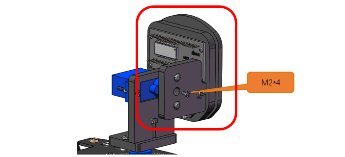
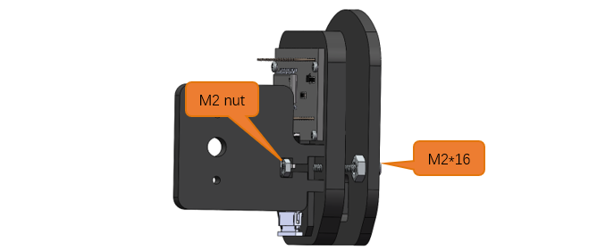
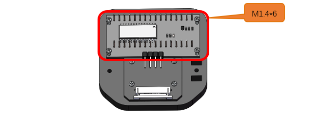
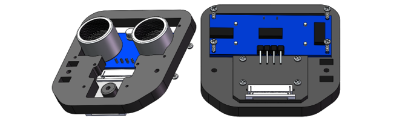
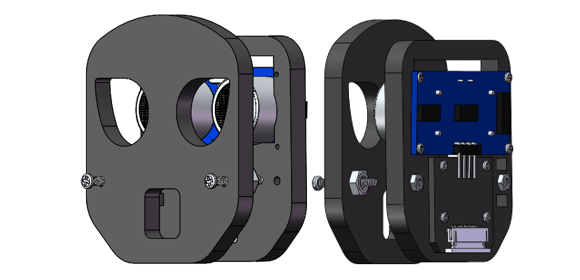
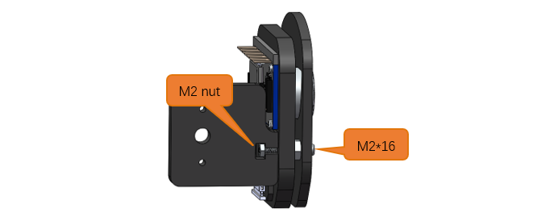
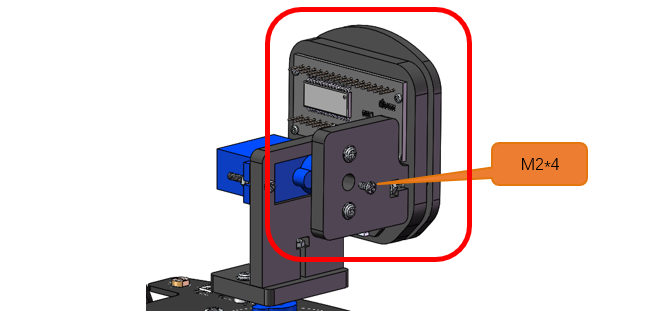
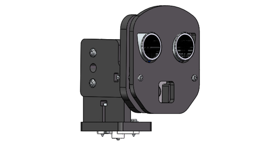

Wiring of the Pan-tilt
==================================

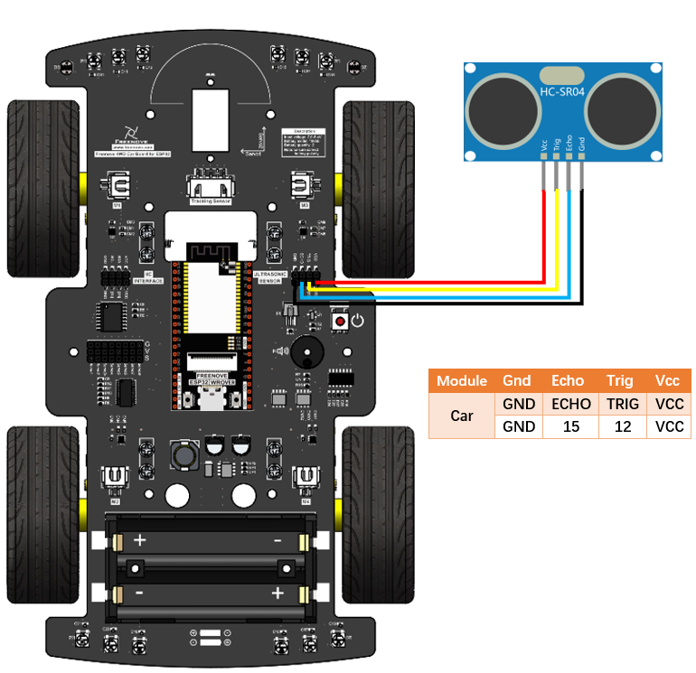

Ultrasonic Module
==================================

The ultrasonic ranging module uses the principle that ultrasonic waves will be sent back when encounter obstacles. We can measure the distance by counting the time interval between sending and receiving of the ultrasonic waves, and the time difference is the total time of the ultrasonic wave's journey from being transmitted to being received. Because the speed of sound in air is a constant, about v=340m/s, we can calculate the distance between the ultrasonic ranging module and the obstacle: s=vt/2.

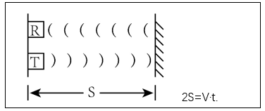

The HC-SR04 ultrasonic ranging module integrates both an ultrasonic transmitter and a receiver. The transmitter is used to convert electrical signals (electrical energy) into high frequency (beyond human hearing) sound waves (mechanical energy) and the function of the receiver is opposite of this. The picture and the diagram of the HC SR04 ultrasonic ranging module are shown below:

.. table::
    :align: center
    :class: table-line
    
    +----------------+----------------+
    | |Chapter03_10| | |Chapter03_11| |
    +----------------+----------------+

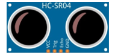
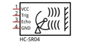

**Pin description:**

.. table::
    :align: center
    :class: zebra
    
    +------+------------------+
    | Pin  | Description      |
    +======+==================+
    | VCC  | Power supply pin |
    +------+------------------+
    | Trig | Trigger pin      |
    +------+------------------+
    | Echo | Echo pin         |
    +------+------------------+
    | GND  | GND              |
    +------+------------------+

**Technical specs:**

Working voltage: 5V     

Working current: 12mA

Minimum measured distance: 2cm          

Maximum measured distance: 200cm

Instructions for use: output a high-level pulse in Trig pin lasting for least 10us, the module begins to transmit ultrasonic waves. At the same time, the Echo pin is pulled up. When the module receives the returned ultrasonic waves from encountering an obstacle, the Echo pin will be pulled down. The duration of high level in the Echo pin is the total time of the ultrasonic wave from transmitting to receiving, s=vt/2. 

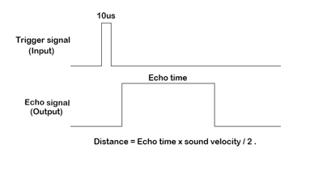

Schematic
=============================

The ultrasonic module is located at the front of the car and is connected to the ESP32 development board by means of wiring. As can be seen from the figure below, ESP32 uses GPIO12 and GPIO15 to control the Trig and Echo pins of the ultrasonic module.

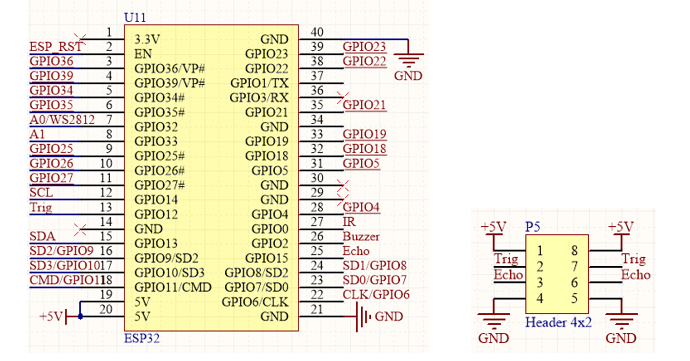

Sketch
=============================

When the power of the car is turned ON, every module will be initialized and the servo motor will rotate to 90°. The ultrasonic data will be obtained and printed through serial port as the servo motor rotates.

Open the folder “02.1_Ultrasonic_Ranging” in **“Freenove_4WD_Car_Kit_for_ESP32\\Sketches”** and double click “02.1_Ultrasonic_Ranging.ino”

Code
-------------------------------

.. literalinclude:: ../../../freenove_Kit/Sketches/02.1_Ultrasonic_Ranging/02.1_Ultrasonic_Ranging.ino
    :linenos: 
    :language: c
    :dedent:

Code Explanation:
-------------------------------

Initialize ultrasonic module and PCA9685 chip.

.. code-block:: c
    :linenos:

    Ultrasonic_Setup();  //Ultrasonic module initialization
    PCA9685_Setup();       //Servo motor initialization

Obtain the distance between ultrasonic module and the obstacle and return a real number data in cm.

.. code-block:: c
    :linenos:

    Get_Sonar()

Rotate the angle of the servo motor 1 and cooperate with the ultrasonic module to obtain distance data.

.. code-block:: c
    :linenos:

    Servo_1_Angle(150);  //Turn servo 1 to 150 degrees
    ...
    Servo_1_Angle(90);   //Turn servo 1 to 90 degrees
    ...
    Servo_1_Angle(30);   //Turn servo 1 to 30 degrees
    ...
    Servo_1_Angle(90);   //Turn servo 1 to 90 degrees

Click “Upload” to upload the code to ESP32. After uploading successfully, click Serial Monitor.

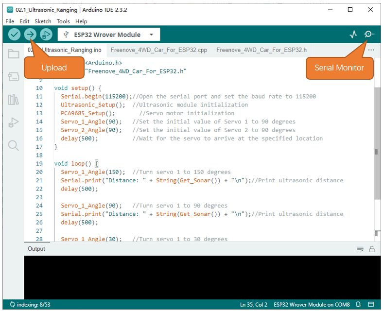

Set the baud rate as 115200. 

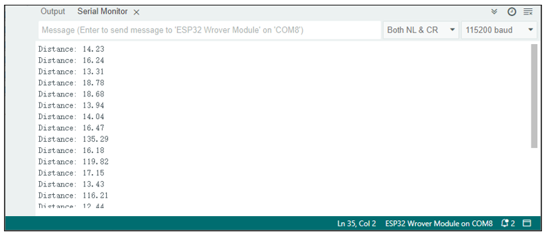

3.2 Ultrasonic car
*********************************

After starting the car, the ultrasound acquires data in various directions, makes judgments based on the data in each direction, and controls the car to avoid obstacles.

Sketch
=================================

Open the folder “02.2_Ultrasonic_Ranging_Car”in **“Freenove_4WD_Car_Kit_for_ESP32\\Sketches”** and double click “02.2_Ultrasonic_Ranging_Car.ino”.

Code
----------------------------------

.. literalinclude:: ../../../freenove_Kit/Sketches/02.2_Ultrasonic_Ranging_Car/02.2_Ultrasonic_Ranging_Car.ino
    :linenos: 
    :language: c
    :dedent:

Code Explanation
----------------------------------

Define an array to store the distance data of the front left, middle, and front right of the car

.. code-block:: c
    :linenos:

    int distance[4];     //Storage of ultrasonic data

The function to get the distance between obstacles and cars. When car_mode is 1, the scanning range is 60-120 degrees; when car_mode is 2, the scanning range is 30-150 degrees.

.. code-block:: c
    :linenos:

    //Get distance values for different angles
    void get_distance(int car_mode)
    {...}

Control the movement function of the car, the parameter range is -4095-4095. When the parameter is a positive number, the motor rotates forward, and vice versa. The greater the absolute value of the parameter, the more powerful the car will be.

.. code-block:: c
    :linenos:

    Motor_Move(M1, M2, M3, M4)