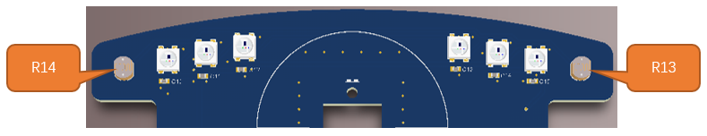

##############################################################################
Chapter 4 Light Tracing Car
##############################################################################

4.1 Photoresistor ADC
************************************

The photoresistor is very sensitive to the amount of light present. We can use this feature to make a light-tracing car. The car is controlled to trun toward the light source by reading the ADC values of the two photoresistors at the head of the car. Before we start, let us learn how to read the photoresistor value.

Photoresistor 
====================================

A photoresistor is simply a light sensitive resistor. It is an active component that decreases resistance with respect to receiving luminosity (light) on the component's light sensitive surface. A photoresistor’s resistance value will change in proportion to the ambient light detected. With this characteristic, we can use a photoresistor to detect light intensity. The photoresistor and its electronic symbol are as follows.

The circuit below is used to detect the change of a photoresistor's resistance value:

In the above circuit, when a photoresistor's resistance vale changes due to a change in light intensity, the voltage between the photoresistor and resistor R1 will also change. Therefore, the intensity of the light can be obtained by measuring this voltage.

Schematic
===================================

The photoresistors are distributed on both sides of the car's head, and the ADC value collection range of A1 is 0-4095. It can be seen from the circuit that when the brightness of the light received by the photoresistor R13 and R14 is the same, the voltage at A1 is 3.3/2*4096, which is 2048. Therefore, when the brightness of the light received by the two photoresistors is different, the value read by the ADC will be greater or less than this value. 

Sketch
=================================

Next we download the code to ESP32 to test the photoresistors. Open the folder “03.1_Photosensitive” in  **“Freenove_4WD_Car_Kit_for_ESP32\\Sketches”** and double click “03.1_Photosensitive.ino”

Code
----------------------------------

.. literalinclude:: ../../../freenove_Kit/Sketches/03.1_Photosensitive/03.1_Photosensitive.ino
    :linenos: 
    :language: c
    :dedent:

Code Explanation
-----------------------------------

Define the pin to read photoresistors.

.. code-block:: c
    :linenos:

    #define PHOTOSENSITIVE_PIN 33 //Define the pins that ESP32 reads photosensitive

Call analogRead to read the differential value of the photoresistors and store it in the photosensitiveADC.

.. code-block:: c
    :linenos:

    photosensitiveADC = analogRead(PHOTOSENSITIVE_PIN);//Read the photosensitive resistance value

Print the photoresistor value through the serial port.

.. code-block:: c
    :linenos:

    Serial.print("photosensitiveADC: ");
    Serial.println(photosensitiveADC);                 //Print photosensitive resistance value

Click “Upload” to upload the code to ESP32. When finishes uploading, click Serial Monitor.

Set baud rate as 115200.

4.2 Light Tracing Car
************************************

When light shines on R13, the resistance value of R13 becomes smaller, and the ADC value of photoresistor becomes larger; when light shines on R14, the resistance value of R14 becomes smaller, and the ADC value of photoresistor becomes smaller. Based on that, when the ADC value is detected to be less than 2048, it indicates that the light source is on the left of the car, and when the ADC value is greater than 2048, it means that the light source is on the right of the car.

Sketch
=====================================

When car is powered ON, the ADC value of the current environment will be obtained. After initialization, the buzzer will sound once to remind users to test the light-tracing function. When users approach the car with light source the car, the car will turn with the light source.

Open the folder “03.2_Photosensitive_Car” in “Freenove_4WD_Car_Kit_for_ESP32\Sketches” and double click “03.2_Photosensitive_Car.ino”

Code
-------------------------------------

.. literalinclude:: ../../../freenove_Kit/Sketches/03.2_Photosensitive_Car/03.2_Photosensitive_Car.ino
    :linenos: 
    :language: c
    :dedent:

Code Explanation
------------------------------------

Set the sensitivity of the photoresistor. You can adjust the value according to the change of the environment. The value is recommended to be between 30-300.

.. code-block:: c
    :linenos:

    int photosensitive_sensitivity = 100;//Set the sensitivity of the photosensitive

Initialize Emotion led matrix, buzzer, photoresistor and motor.

.. code-block:: c
    :linenos:

    Emotion_Setup();         //Emotion initialization
    Buzzer_Setup();          //Buzzer initialization
    Photosensitive_Setup();  //Photosensitive initialization
    PCA9685_Setup();         //Initialize PCA9685 to control motor

Get the ADC value of ambient light during initialization.

.. code-block:: c
    :linenos:

    photosensitive_init_value = Get_Photosensitive();

Determine the relative position of the light source and the car.

.. code-block:: c
    :linenos:

    if (Get_Photosensitive() < (photosensitive_init_value - photosensitive_sensitivity))
    ...
    else if (Get_Photosensitive() > (photosensitive_init_value + photosensitive_sensitivity))
    ...
    else