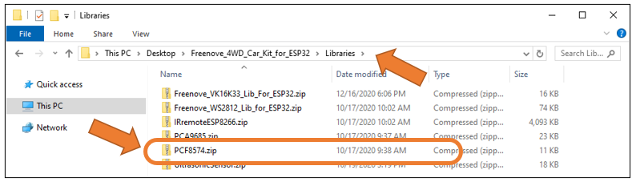

##############################################################################
Chapter 5 Line Tracking Car
##############################################################################

5.1 Line tracking sensor 
*************************************

Track Sensor
====================================
There are three Reflective Optical Sensors on this car. When the infrared light emitted by infrared diode shines on the surface of different objects, the sensor will receive light with different intensities after reflection.

As we know, black objects absorb light better. So when black lines are drawn on the white plane, the sensor can detect the difference. The sensor can also be called Line Tracking Sensor.

:combo:`red font-bolder:Warning:`

:combo:`red font-bolder:Reflective Optical Sensor (including Line Tracking Sensor) should be avoided using in environment with infrared interference, like sunlight. Sunlight contains a lot of invisible light such as infrared and ultraviolet. Under environment with intense sunlight, Reflective Optical Sensor cannot work normally.`

The following table shows the values of all cases when three Tracking Sensors detect objects of different colors.

Among them, black objects or no objects were detected to represent 1, and white objects were detected to represent 0.

.. table::
    :align: center
    :class: zebra
    
    +------+--------+-------+---------------+----------------+
    | Left | Middle | Right | Value(binary) | Value(decimal) |
    +======+========+=======+===============+================+
    | 0    | 0      | 0     | 000           | 0              |
    +------+--------+-------+---------------+----------------+
    | 0    | 0      | 1     | 001           | 1              |
    +------+--------+-------+---------------+----------------+
    | 0    | 1      | 0     | 010           | 2              |
    +------+--------+-------+---------------+----------------+
    | 0    | 1      | 1     | 011           | 3              |
    +------+--------+-------+---------------+----------------+
    | 1    | 0      | 0     | 100           | 4              |
    +------+--------+-------+---------------+----------------+
    | 1    | 0      | 1     | 101           | 5              |
    +------+--------+-------+---------------+----------------+
    | 1    | 1      | 0     | 110           | 6              |
    +------+--------+-------+---------------+----------------+
    | 1    | 1      | 1     | 111           | 7              |
    +------+--------+-------+---------------+----------------+

Sketch
===================================

**The car calls the PCF8574 library file, if you haven't installed it yet, please install it first.**

Click “Sketch”, select “Include Library” and then select Add .ZIP Library...”.

Input “PCF8574” in the searching field and find the library marked below, click “Install”.

The line tracking module is connected to the PCF8574. The ESP32 obtains whether the three channels of the line tracking module are triggered by reading the IO value of the PCF8574, and prints it out through the serial port.

Open the folder “04.1_Tracking_Sensor” in **“Freenove_4WD_Car_Kit_for_ESP32\\Sketches”** and double click “04.1_Tracking_Sensor.ino”.

Code
-------------------------------------

.. literalinclude:: ../../../freenove_Kit/Sketches/04.1_Tracking_Sensor/04.1_Tracking_Sensor.ino
    :linenos: 
    :language: c
    :dedent:

Code Explanation
-------------------------------------

Initialize PCF8574 chip.

.. code-block:: c
    :linenos:

    Track_Setup();

The function that obtains the tracking module feedback value. After calling this function, ESP32 will store the data in the array sensorValue[].

.. code-block:: c
    :linenos:

    Track_Read();

Print the obtained feedback value through serial port.

.. code-block:: c
    :linenos:

    Serial.print("Sensor Value (L / M / R / ALL) : ");
    for (int i = 0; i < 4; i++) {
        Serial.print(sensorValue[i]);
        Serial.print('\t');
    }
    Serial.print('\n');

Click “Upload” to upload to code to ESP32 development board. After uploading successfully, click “Serial Monitor”.

5.2 Line Tracking Car
********************************

The car will make different actions according to the value transmitted by the line-tracking sensor.

.. table::
    :align: center
    :class: zebra zebra-theme-blue
    
    +------+--------+-------+---------------+----------------+--------------+
    | Left | Middle | Right | Value(binary) | Value(decimal) |    Action    |
    +======+========+=======+===============+================+==============+
    | 0    | 0      | 0     | 000           | 0              | Stop         |
    +------+--------+-------+---------------+----------------+--------------+
    | 0    | 0      | 1     | 001           | 1              | Turn Left    |
    +------+--------+-------+---------------+----------------+--------------+
    | 0    | 1      | 0     | 010           | 2              | Move Forward |
    +------+--------+-------+---------------+----------------+--------------+
    | 0    | 1      | 1     | 011           | 3              | Turn Left    |
    +------+--------+-------+---------------+----------------+--------------+
    | 1    | 0      | 0     | 100           | 4              | Turn Right   |
    +------+--------+-------+---------------+----------------+--------------+
    | 1    | 0      | 1     | 101           | 5              | Move Forward |
    +------+--------+-------+---------------+----------------+--------------+
    | 1    | 1      | 0     | 110           | 6              | Turn Right   |
    +------+--------+-------+---------------+----------------+--------------+
    | 1    | 1      | 1     | 111           | 7              | Stop         |
    +------+--------+-------+---------------+----------------+--------------+

Turn on the power. Use a black tape to build a line and then put your car on it as below.

Sketch
================================

Open the folder “04.2_Track_Car” in “Freenove_4WD_Car_Kit_for_ESP32\\Sketches” and double click “04.2_Track_Car.ino”.

Code
--------------------------------

.. literalinclude:: ../../../freenove_Kit/Sketches/04.2_Track_Car/04.2_Track_Car.ino
    :linenos: 
    :language: c
    :dedent:

Code Explanation
---------------------------------

Initialize PCF8574 chip, PCA9685 chip, Emotion module.

.. code-block:: c
    :linenos:

    Track_Setup();   //Trace module initialization
    PCA9685_Setup(); //Motor drive initialization
    Emotion_Setup(); //Emotion initialization

The function that obtains the tracking module feedback value. After calling this function, ESP32 will store the data in the array sensorValue[].

.. code-block:: c
    :linenos:

    Track_Read();

Control the car to move forward, turn left, turn right, stop, etc. based on the value of line tracking module.

.. code-block:: c
    :linenos:

    switch (sensorValue[3])
    {
        case 2:   //010
        case 5:   //101
            showArrow(1, 100);
            Motor_Move(SPEED_LV1, SPEED_LV1, SPEED_LV1, SPEED_LV1);    //Move Forward
            break;
        case 0:   //000
        case 7:   //111
            eyesBlink1(100);
            Motor_Move(0, 0, 0, 0);                                    //Stop
            break;
        case 4:   //100
        case 6:   //110
            wheel(2, 100);
            Motor_Move(SPEED_LV4, SPEED_LV4 , - SPEED_LV3, -SPEED_LV3);//Turn Right
            break;
        case 1:   //001
        case 3:   //011
            wheel(1, 100);
            Motor_Move(-SPEED_LV3, -SPEED_LV3, SPEED_LV4, SPEED_LV4);  //Turn Left
            break;
        default:
            break;
    }

.. note:: 
    
    The tracks made of black tape vary from different people. If your car cannot move along the black tape, you can modify the parameters in Motor_Move().