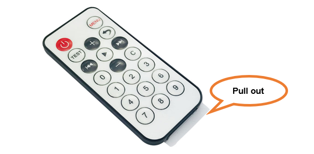
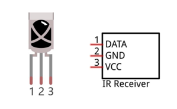
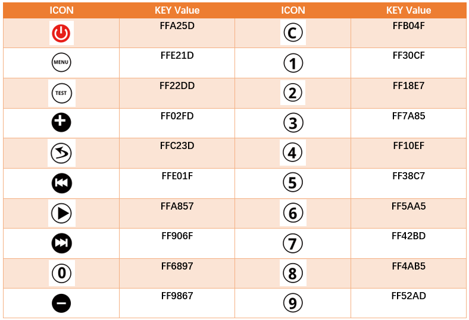
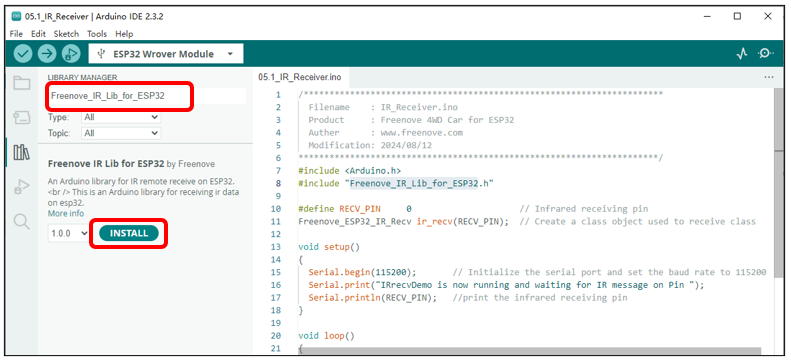
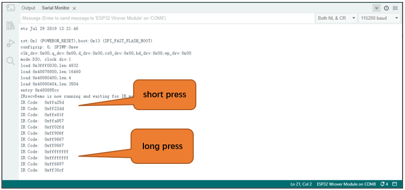
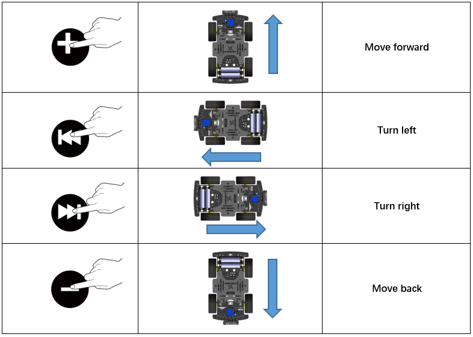
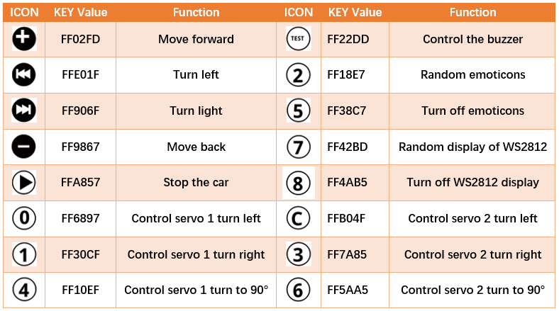

##############################################################################
Chapter 6 Infrared Car
##############################################################################

6.1 Introduction of infrared reception function
*****************************************************

Infrared Remote
=========================================

An infrared(IR) remote control is a device with a certain number of buttons. Pressing down different buttons will make the infrared emission tube, which is located in the front of the remote control, send infrared ray with

different command. Infrared remote control technology is widely used in electronic products such as TV, air conditioning, etc. Thus making it possible for you to switch TV programs and adjust the temperature of the air conditioning when away from them. The remote control we use is shown below:

Infrared receiver
==========================================

An infrared(IR) receiver is a component which can receive the infrared light, so we can use it to detect the signal emitted by the infrared remote control. DATA pin here outputs the received infrared signal.

When you use the infrared remote control, the infrared remote control sends a key value to the receiving circuit according to the pressed keys. We can program the ESP32-WROVER to do things like lighting, when a key value is received. 

The following is the key value that the receiving circuit will receive when each key of the infrared remote control is pressed.

This sketch uses the infrared receiving tube to receive the value sent form the infrared remote control, and print it out via the serial port.

Sketch
=============================

We use the third party library **Freenove_IR_Lib_for_ESP32**. If you haven't installed it yet, please do so first. 

The steps to add third-party Libraries are as follows: open arduino -> Sketch -> Include library -> Manage libraries. Enter **"Freenove_IR_Lib_for_ESP32"** in the search bar and select **"Freenove_IR_Lib_for_ESP32"** for installation.

Refer to the following operations:

Each time when you press the infrared remote control, the car will print the received infrared coding value through serial port.

Open the folder “05.1_IR_Receiver” in “Freenove_4WD_Car_Kit_for_ESP32\\Sketches” and double click “05.1_IR_Receiver.ino”.

Code
---------------------------------

.. literalinclude:: ../../../freenove_Kit/Sketches/05.1_IR_Receiver/05.1_IR_Receiver.ino
    :linenos: 
    :language: c
    :dedent:

Download the code to ESP32-WROVER, open the serial port monitor, set the baud rate to 115200, press the IR remote control, the pressed keys value will be printed out through the serial port. As shown in the following figure: (Note that when the remote control button is pressed for a long time, the infrared receiving circuit receives a continuous high level, that is, it receives a hexadecimal "F")

First, include header file. Each time you use the infrared library, you need to include the header file at the beginning of the program.

.. code-block:: c
    :linenos:

    #include <Arduino.h>
    #include "Freenove_IR_Lib_for_ESP32.h"

Second, define an infrared receive pin and associates it with the receive class. 

.. code-block:: c
    :linenos:

    #define RECV_PIN     0                     // Infrared receiving pin
    Freenove_ESP32_IR_Recv ir_recv(RECV_PIN);  // Create a class object used to receive class

Call the task() function to receive the infrared signal.

Call the nec_available() function to determine if the NEC protocol signal is received.

Call data() to get the infrared received data.

.. code-block:: c
    :linenos:

    void loop()
    {
        ir_recv.task();                  //Get IR receice data.
        if(ir_recv.nec_available()){     //The data of the NEC protocol is checked
            //Print IR data.
            Serial.printf("IR Code:  %#x\r\n", ir_recv.data());
        }
        delay(100);
    }

For more information about Infrared Remote Control, please visit:

https://github.com/Freenove/Freenove_IR_Lib_for_ESP32

6.2 Infrared Car
*****************************

On the basis of the previous section, we use the infrared remote control to control the car. Press the black button on the infrared remote control to control the car to move forward, backward, turn left, and turn right. Press the other buttons and the cart stops moving.

Sketch
=============================

Open the folder “05.2_IR_Receiver_Car” in the **“Freenove_4WD_Car_Kit_for_ESP32\\Sketches”** and double click “05.2_IR_Receiver_Car.ino”.

Code
----------------------------

.. literalinclude:: ../../../freenove_Kit/Sketches/05.2_IR_Receiver_Car/05.2_IR_Receiver_Car.ino
    :linenos: 
    :language: c
    :dedent:

Compile and upload the code to the ESP32-WROVER. When pressing "0", "1", "2", "3" of the infrared remote control, the buzzer will sound once, and the brightness of the LED light will change correspondingly.

Code Explanation
------------------------------

Call the decode function to obtain the infrared remote control coding information, and call the handleControl function to execute actions corresponding to different code values. After each execution of the program, call the resume function to release the infrared pin. If this function is not called, the infrared receiving and decoding functions cannot be used again.

.. code-block:: c
    :linenos:

    void loop(){
        ir_recv.task();                  //Get IR receice data.
        if(ir_recv.nec_available()){     //The data of the NEC protocol is checked
            handleControl(ir_recv.data())
        }
        showEmotion(emotionMode);
    }

Infrared key code value processing function, received the infrared remote control sent instructions, the execution of the corresponding program.

.. code-block:: c
    :linenos:

    void handleControl(unsigned long value) {
    // Handle the commands
    switch (value) { 
            case 0xFF02FD:// Receive the number '+'
            ...
            case 0xFF9867:// Receive the number '-'
            ...
            case 0xFFE01F:// Receive the number '|<<'
            ...
            case 0xFF906F:// Receive the number '>>|'
            ...
            case 0xFF6897:
            ...
            case 0xFFFFFFFF:// Remain unchanged
            ...
            default:        // Control the car to stop moving
            ...
        }
    }

6.3 Multi-Functional Infrared Car
*******************************************

On the basis of the last section, we integrate other functions of the car into the infrared car, and most of the functions of the car can be controlled by the infrared remote control.

Sketch
====================================

Open the folder “05.3_Multi_Functional_Car” in the **“Freenove_4WD_Car_Kit_for_ESP32\\Sketches”** and double click “05.3_Multi_Functional_Car.ino”.

Code
--------------------------------------

.. literalinclude:: ../../../freenove_Kit/Sketches/05.3_Multi_Functional_Car/05.3_Multi_Functional_Car.ino
    :linenos: 
    :language: c
    :dedent:

After the code is successfully uploaded, turn on the power of the car and use the infrared remote control to control the car and other functions. The corresponding keys and their functions are shown in the following table:

Code Explanation:
-------------------------------------

Add the header file for the car.

.. code-block:: c
    :linenos:

    #include <Arduino.h>
    #include "Freenove_IR_Lib_for_ESP32.h"
    #include "Freenove_4WD_Car_For_ESP32.h"
    #include "Freenove_4WD_Car_Emotion.h"
    #include "Freenove_WS2812_Lib_for_ESP32.h"

Initialize each function of the car.

.. code-block:: c
    :linenos:

    Serial.begin(115200);
    PCA9685_Setup();
    Buzzer_Setup();
    Emotion_Setup();
    strip.begin();
    strip.setBrightness(10);  
    Servo_1_Angle(servo_1_angle);
    Servo_2_Angle(servo_2_angle);

Set the color of WS2812 and have it display the corresponding color.

.. code-block:: c
    :linenos:

    void WS2812_Show(){
        for (int i = 0; i < 12; i++)
            strip.setLedColorData(i, m_color[ws2812_flag][0], m_color[ws2812_flag][1], m_color[ws2812_flag][2]);
        strip.show();
    }

Infrared key code value processing function, received the infrared remote control sent instructions, the execution of the corresponding program.

.. code-block:: c
    :linenos:

    void handleControl(unsigned long value) {
    // Handle the commands
    switch (value) {
            case 0xFF02FD:// Receive the number '+'
            ...
            case 0xFF9867:// Receive the number '-'
            ...
            case 0xFFE01F:// Receive the number '|<<'
            ...
            case 0xFF906F:// Receive the number '>>|'
            ...
            case 0xFFA857:// Receive the number '▶'
            ...
            case 0xFF6897:// Receive the number '0'
            ...
            case 0xFF30CF:// Receive the number '1'
            ...
            case 0xFF10EF:// Receive the number '4'
            ...
            case 0xFFB04F:// Receive the number 'C'
            ...
            case 0xFF7A85:// Receive the number '3'
            ...
            case 0xFF5AA5:// Receive the number '6'
            ...
            case 0xFF22DD:// Receive the number 'TEST'
            ...
            case 0xFF18E7:// Receive the number '2'
            ...
            case 0xFF38C7:// Receive the number '5'
            ...
            case 0xFF42BD:// Receive the number '7'
            ...
            case 0xFF4AB5:// Receive the number '8'
            ...
            case 0xFFFFFFFF:// Remain unchanged
            ...
            default:
                break;
        }
    }