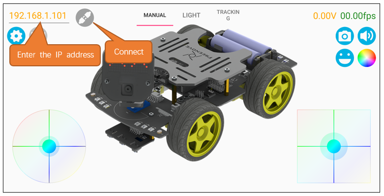
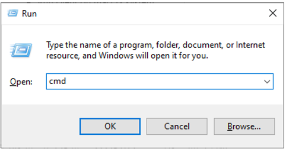
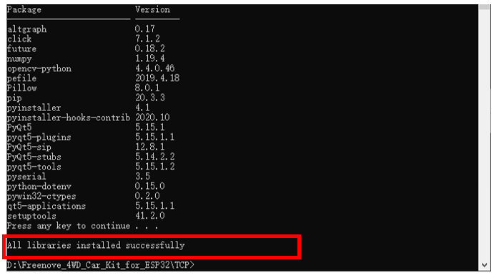

##############################################################################
Chapter 7 WiFi Car
##############################################################################

7.1 WiFi Sending and Receiving Data
************************************************

Before programming, we need to have a basic understanding of WiFi.

Station mode
==================================

When ESP32 selects Station mode, it acts as a WiFi client. It can connect to the router network and communicate with other devices on the router via WiFi connection. As shown below, the PC is connected to the router, and if ESP32 wants to communicate with the PC, it needs to be connected to the router.

AP mode
==================================

When ESP32 selects AP mode, it creates a hotspot network that is separate from the Internet and waits for other WiFi devices to connect. As shown in the figure below, ESP32 is used as a hotspot. If a mobile phone or PC wants to communicate with ESP32, it must be connected to the hotspot of ESP32. Only after a connection is established with ESP32 can they communicate.

AP+Station mode
===================================

In addition to AP mode and station mode, ESP32 can also use AP mode and station mode at the same time. This mode contains the functions of the previous two modes. Turn on ESP32's station mode, connect it to the router network, and it can communicate with the Internet via the router. At the same time, turn on its AP mode to create a hotspot network. Other WiFi devices can choose to connect to the router network or the hotspot network to communicate with ESP32.

TCP connection
==================================

Before transmitting data, TCP needs to establish a logical connection between the sending end and the receiving end. It provides reliable and error-free data transmission between the two computers. In the TCP connection, the client and the server must be clarified. The client sends a connection request to the server, and each time such a request is proposed, a "three-times handshake" is required.

Three-times handshake: In the TCP protocol, during the preparation phase of sending data, the client and the server interact three times to ensure the reliability of the connection, which is called "three-times handshake".

The first handshake, the client sends a connection request to the server and waits for the server to confirm.

The second handshake, the server sends a response back to the client informing that it has received the connection request.

The third handshake, the client sends a confirmation message to the server again to confirm the connection. 

.. image:: ../_static/imgs/7_WiFi_Car/Chapter07_02.png
    :align: center

TCP is a connection-oriented, low-level transmission control protocol. After TCP establishes a connection, the client and server can send and receive messages to each other, and the connection will always exist as long as the client or server does not initiate disconnection. Each time one party sends a message, the other party will reply with an ack signal.

Install Freenove app
================================

There are three ways to install app, you can choose any one. 

Method 1
-------------------------------

Use Google play to search “Freenove”, download and install.

Method 2
--------------------------------

Visit https://play.google.com/store/apps/details?id=com.freenove.suhayl.Freenove, and click install.

Method 3
--------------------------------

Visit https://github.com/Freenove/Freenove_app_for_Android, download the files in this library, and install freenove.apk to your Android phone manually. 

Menu
---------------------------------

Open application “Freenove”, as shown below:

Introduction of the APP
==================================

In this chapter, we use Freenove 4WD Car for ESP32, so it is necessary to understand the interface of this mode. 

Sketch
===================================

Open “06.1_WiFi_APP_TcpServer” in **"Freenove_4WD_Car_Kit_for_ESP32\\Sketches"** and double click “06.1_WiFi_APP_TcpServer.ino”.

Before uploading the code, you need to modify it based on the name and password of your router.

Code
-------------------------------------

.. literalinclude:: ../../../freenove_Kit/Sketches/06.1_WiFi_APP_TcpServer/06.1_WiFi_APP_TcpServer.ino
    :linenos: 
    :language: c
    :dedent:

Uplode the code to ESP32 car and open serial monitor.

Open mobliephone app and select Freenove 4WD Car for ESP32.

Make sure your mobile phone and ESP32 car are connected to the same router. According to the aforementioned IP address, enter the corresponding IP address, and then click Connect. Tap the button on the screen and you can see the data on the serial monitor.

Code Explanation:
-------------------------------------

Add the library functions of WiFi. Each time before using WiFi, please add these library functions.

.. code-block:: c
    :linenos:

    #include <WiFi.h>
    #include <WiFiClient.h>
    #include <WiFiAP.h>

Define four pointer variables to store information.

.. code-block:: c
    :linenos:

    const char* ssid_Router     =   "********";//Modify according to your router name
    const char* password_Router =   "********";//Modify according to your router password
    const char* ssid_AP         =   "Sunshine";//ESP32 turns on an AP and calls it Sunshine
    const char* password_AP     =   "Sunshine";//Set your AP password for ESP32 to Sunshine

Turn ON AP feature of ESP32. When the function is called, you can search a WiFi signal named “Sunshine” in your phone.

.. code-block:: c
    :linenos:

    WiFi.softAP(ssid_AP, password_AP);//Turn on ESP32's AP feature

The mobile app uses two servers, one for transmitting images and one for transmitting commands. Set ESP32 to start the two servers. The server with port 7000 is used to receive image data (not used in this section for the time being), and the server with port 4000 is used to transmit commands. Call the setNoDelay function to send and receive data directly.

.. code-block:: c
    :linenos:

    server_Camera.begin(7000);        //Turn on camera server
    server_Cmd.begin(4000);           //Turn on Cmd server
    server_Camera.setNoDelay(true);   //Set no delay in sending and receiving data
    server_Cmd.setNoDelay(true);      //Set no delay in sending and receiving data

Connect ESP32 to the router. After the router is successfully connected, ESP32 will print the IP address information to the serial monitor. If there is no router near you, or the router fails to connect, you can delete this code.

.. code-block:: c
    :linenos:

    //////////////////////////////////////////////////////////
    WiFi.begin(ssid_Router, password_Router);//Make a connector request to the router
    Serial.print("Connecting ");
    Serial.print(ssid_Router);
    int timeout=0;
    while (WiFi.status() != WL_CONNECTED) { //If the connection fails, wait half a second for another connection request
        delay(500);
        Serial.print(".");
        timeout++;
        if(timeout==20)
        break;
    }
    timeout=0;
    while (WiFi.STA.hasIP() != true) {
        Serial.print(".");
        delay(500);
        timeout++;
        if(timeout==20)
        break;
    }
    //////////////////////////////////////////////////////////

Define a WiFi client object to monitor whether the server has a client request access signal.

.. code-block:: c
    :linenos:

    WiFiClient client = server_Cmd.available();//listen for incoming clients

Determine whether there is a client connected to the server.

.. code-block:: c
    :linenos:

    while (client.connected()) {//loop while the client's connected

Call available function to query whether the client has sent data to the server.

.. code-block:: c
    :linenos:

    if (client.available()) { //if there's bytes to read from the client,

Call readStringUntil function to read a line of data from the client and print it to the serial monitor.

.. code-block:: c
    :linenos:

    String dataBuffer = client.readStringUntil('\n') + String("\n"); //read data
    Serial.print(dataBuffer);//print it out the serial monitor

Call stop() function to close the client connection.

.. code-block:: c
    :linenos:

    client.stop();// close the connection:

Reference
----------------------------------

.. py:function:: Class Station	
    
    Every time when using WiFi, you need to include header file "WiFi.h.".
    
    **begin(ssid, password,channel, bssid, connect):** ESP32 is used as Station to connect hotspot.
    
    **ssid:** WiFi hotspot name
    
    **password:** WiFi hotspot password
    
    **channel:** WiFi hotspot channel number; communicating through specified channel; optional parameter 
    
    **bssid:** mac address of WiFi hotspot, optional parameter
    
    **connect:** blloean optional parameter, defaulting to true. If set as false, then ESP32 won't connect WiFi.
    
    **config(local_ip, gateway, subnet, dns1, dns2):** set static local IP address.
    
    **local_ip:** station fixed IP address.
    
    **subnet:** subnet mask
    
    **dns1,dns2:** optional parameter. define IP address of domain name server
    
    **status:** obtain the connection status of WiFI
    
    **local IP():** obtian IP address in Station mode 
    
    **disconnect():** disconnect wifi
    
    **setAutoConnect(boolen):** set automatic connection Every time ESP32 is power on, it will connect WiFi aitomatically.
    
    **setAutoReconnect(boolen):** set automatic reconnection Every time ESP32 disconnects WiFi, it will reconnect to WiFi automatically.

.. py:function:: Class AP	
    
    Every time when using WiFi, you need to include header file "WiFi.h.".
    
    **softAP(ssid, password, channel, ssid_hidden, max_connection):**
    
    **ssid:** WiFi hotspot name
    
    **password:** WiFi hotspot password
    
    **channel:** Number of WiFi connection channels, range 1-13. The default is 1.
    
    **ssid_hidden:** Whether to hide WiFi name from scanning by other devices. The default is not hide.
    
    **max_connection:** Maximum number of WiFi connected devices. The range is 1-4. The default is 4.
    
    **softAPConfig(local_ip, gateway, subnet):** set static local IP address. 
    
        **local_ip:** station fixed IP address.
        
        **Gateway:** gateway IP address
        
        **subnet:** subnet mask
    
    **softAP():** obtian IP address in AP mode 
    
    **softAPdisconnect():** disconnect AP mode.

.. py:function:: Class Client	

    Every time when using Client, you need to include header file "WiFi.h."

    **connect(ip, port, timeout)/connect(\*host, port, timeout):** establish a TCP connection.

        **ip, \*host:** ip address of target server

        **port:** port number of target server

        **timeout:** connection timeout

    **connected():** judge whether client is connecting. If return value is 1, then connect successfully; If return value is 0, then fail to connect.

    **stop():** stop tcp connection

    **print():** send data to server connecting to client

    **available():** return to the number of bytes readable in receive buffer, if no, return to 0 or -1.

    **read():** read one byte of data in receive buffer

    **readString():** read string in receive buffer

.. py:function:: Class Server

    Every time use Server functionality, we need to include header file"WiFi.h".

    **WiFiServer(uint16_t port=80, uint8_t max_clients=4):** create a TCP Server.

        **port:** ports of Server; range from 0 to 65535 with the default number as 80.

        **max_clients:** maximum number of clients with default number as 4.

    **begin(port):** start the TCP Server.

        **port:** ports of Server; range from 0 to 65535 with the default number as 0.

    **setNoDelay(bool nodelay):** whether to turn off the delay sending functionality.

        **nodelay:** true stands for forbidden Nagle algorithm.

    **close():** close tcp connection.

    **stop():** stop tcp connection.

7.2 WiFi Transmitting Images
**************************************

Earlier we used the WiFi to transmit command. In this section, we use WiFi to transmit image data and display the picture taken by the ESP32 car on the mobile APP.

Sketch
=======================================

Open the folder “06.2_WiFi_Cam_TcpServer” in the “Freenove_4WD_Car_Kit_for_ESP32\\Sketches” and double click “06.2_WiFi_Cam_TcpServer.ino”.

Before uploading the code, please modify the name and password of Router. Other operation is the same as Section :ref:`7.1 <fnk0053/codes/tutorial/7_wifi_car:7.1 wifi sending and receiving data>`.

Code
---------------------------------------

.. literalinclude:: ../../../freenove_Kit/Sketches/06.2_WiFi_Cam_TcpServer/06.2_WiFi_Cam_TcpServer.ino
    :linenos: 
    :language: c
    :dedent:

Upload code to ESP32 car and open serial monitor.

Open mobile APP and select Freenove 4WD Car for ESP32. 

Make sure your mobile phone and ESP32 car are connected to the same router. According to the aforementioned IP address, enter the corresponding IP address, and then click Connect. Tap the button on the screen and you can see the data on the serial monitor.

Code Explanation:
--------------------------------------

Before using camera, please add two header files esp_camera.h and camera_pins.h .

.. code-block:: c
    :linenos:

    #include "esp_camera.h"
    #include <WiFi.h>
    #include <WiFiClient.h>
    #include <WiFiAP.h>

    #define CAMERA_MODEL_WROVER_KIT
    #include "camera_pins.h"

Define four pointer variables to store information. Each time, before using, please modify name and password of Router.

.. code-block:: c
    :linenos:

    const char* ssid_Router     =   "********";//Modify according to your router name
    const char* password_Router =   "********";//Modify according to your router password
    const char* ssid_AP         =   "Sunshine";//ESP32 turns on an AP and calls it Sunshine
    const char* password_AP     =   "Sunshine";//Set your AP password for ESP32 to Sunshine

Camara initialization function that assign pins to camera and sets the camera clock frequency, picture quality, picture size and other information. 

.. code-block:: c
    :linenos:

    void cameraSetup() {
        camera_config_t config;
        config.ledc_channel = LEDC_CHANNEL_0;
        config.ledc_timer = LEDC_TIMER_0;
        config.pin_d0 = Y2_GPIO_NUM;
        config.pin_d1 = Y3_GPIO_NUM;
        config.pin_d2 = Y4_GPIO_NUM;
        config.pin_d3 = Y5_GPIO_NUM;
        config.pin_d4 = Y6_GPIO_NUM;
        config.pin_d5 = Y7_GPIO_NUM;
        config.pin_d6 = Y8_GPIO_NUM;
        config.pin_d7 = Y9_GPIO_NUM;
        config.pin_xclk = XCLK_GPIO_NUM;
        config.pin_pclk = PCLK_GPIO_NUM;
        config.pin_vsync = VSYNC_GPIO_NUM;
        config.pin_href = HREF_GPIO_NUM;
        config.pin_sccb_sda = SIOD_GPIO_NUM;
        config.pin_sccb_scl = SIOC_GPIO_NUM;
        config.pin_pwdn = PWDN_GPIO_NUM;
        config.pin_reset = RESET_GPIO_NUM;
        config.xclk_freq_hz = 20000000;
        config.pixel_format = PIXFORMAT_JPEG;
        config.frame_size = FRAMESIZE_VGA;   //clear
        //	config.frame_size = FRAMESIZE_QVGA;  //ordinary
        //	config.frame_size = FRAMESIZE_QQVGA; //concision
        config.jpeg_quality = 10;
        config.fb_count = 1;
        esp_err_t err = esp_camera_init(&config); // camera init
        if (err != ESP_OK) {
            Serial.printf("Camera init failed with error 0x%x", err);
            return;
        }
        Serial.println("Camera configuration complete!");
    }

ESP32 is a dual-core processor, which can handle different things at the same time. Usually the loop function of ESP32 runs in the first core area. In this code, we make the command processing run in the 0th core area and the camera data processing in the first core area. Call the disableCore0WDT() function to turn off the watchdog in the 0th core area to avoid program reset caused by the watchdog. Call the xTaskCreateUniversal function to apply to create a task function and let the task function run in the 0th core area.

.. code-block:: c
    :linenos:
    
    disableCore0WDT();
	//loopTask_Cmd uses core 0.
	xTaskCreateUniversal(loopTask_Cmd, "loopTask_Cmd", 8192, NULL, 1, &loopTaskHandle, 0);

Define a camera image data storage object to store image data.

.. code-block:: c
    :linenos:
    
    camera_fb_t * fb = NULL;

Call the esp_camera_fb_get() function to get the image data and store it in fb. Call the write() function to send the data to the mobile app.

.. code-block:: c
    :linenos:
    
    fb = esp_camera_fb_get();
	if (fb != NULL) {
		uint8_t slen[4];
		slen[0] = fb->len >> 0;
		slen[1] = fb->len >> 8;
		slen[2] = fb->len >> 16;
		slen[3] = fb->len >> 24;
		client.write(slen, 4);
		client.write(fb->buf, fb->len);
		esp_camera_fb_return(fb);
	}

Reference
---------------------------

+-------------------+-----------+------------------+-----------+
| Image resolution  | Sharpness | Image resolution | Sharpness |
+===================+===========+==================+===========+
| FRAMESIZE_96x96   | 96x96     | FRAMESIZE_HVGA   | 480x320   |
+-------------------+-----------+------------------+-----------+
| FRAMESIZE_QQVGA   | 160x120   | FRAMESIZE_VGA    | 640x480   |
+-------------------+-----------+------------------+-----------+
| FRAMESIZE_QCIF    | 176x144   | FRAMESIZE_SVGA   | 800x600   |
+-------------------+-----------+------------------+-----------+
| FRAMESIZE_HQVGA   | 240x176   | FRAMESIZE_XGA    | 1024x768  |
+-------------------+-----------+------------------+-----------+
| FRAMESIZE_240x240 | 240x240   | FRAMESIZE_HD     | 1280x720  |
+-------------------+-----------+------------------+-----------+
| FRAMESIZE_QVGA    | 320x240   | FRAMESIZE_SXGA   | 1280x1024 |
+-------------------+-----------+------------------+-----------+
| FRAMESIZE_CIF     | 400x296   | FRAMESIZE_UXGA   | 1600x1200 |
+-------------------+-----------+------------------+-----------+

7.3 WiFi Video Car by APP
**********************************************

In this section, we will combine image transmission with controlling the car. You can control the ESP32 car through mobile APP while observing the images that the camera transmits.

Sketch
==========================================

Open the folder “06.3_Multi_Functional_Car” in Freenove_4WD_Car_Kit_for_ESP32\\Sketches and double click “06.3_Multi_Functional_Car.ino”.

Before compiling the code, please modify the code according to the name and password of your WiFi.

If you want to enable ESP32's own router functionality, WiFi_Setup(1); If you want ESP32 to connect to the router, WiFi_Setup(0).

Code
------------------------------------------

.. literalinclude:: ../../../freenove_Kit/Sketches/06.3_Multi_Functional_Car/06.3_Multi_Functional_Car.ino
    :linenos: 
    :language: c
    :dedent:

Code Explanation:
------------------------------------------

Add the driver headr files of the car. 

The three header files starting with "WiFi" contain the WiFi driver configuration function of ESP32.

The esp_camera.h file contains the control function of ESP32 camera.

Freenove_4WD_Car_WiFi.h contains the command information when WiFi transmits signal and the ESP32 pin configuration of the camera.

Freenove_4WD_Car_Emotion.h contains the driver configuration function of the LED matrix module. 

Freenove_4WD_Car_WS2812.h contains the driver configuration function of the RGB LEDs. Freenove_4WD_Car_For_ESP32.h contains the driver configuration function of the car.

.. literalinclude:: ../../../freenove_Kit/Sketches/06.3_Multi_Functional_Car/06.3_Multi_Functional_Car.ino
    :linenos: 
    :language: c
    :lines: 8-16
    :dedent:

Before you upload the code each time, you can change the ssid_Router and password_Router below based on your WiFi name and password. The program uses AP mode by default. ESP32 will create a WiFi called "Sunshine" based on the WiFi configuration.

.. note::
    
    "Sunshine" is not connected to the Internet. So if you choose to connect to it, your phone will be disconnected from the Internet. “frame_size” is used to configure the pixel size of the camera. If you don’t know its parameters, you can click here.

.. literalinclude:: ../../../freenove_Kit/Sketches/06.3_Multi_Functional_Car/06.3_Multi_Functional_Car.ino
    :linenos:
    :language: c
    :lines: 23-27
    :dedent:

Turn ON two TCP server ports. Port 4000 is used to receive the command from the car and port 7000 is to receive the image data collected by camera.

.. literalinclude:: ../../../freenove_Kit/Sketches/06.3_Multi_Functional_Car/06.3_Multi_Functional_Car.ino
    :linenos:
    :language: c
    :lines: 30-31
    :dedent:

Call the WiFi_Init() to initialize the WiFi parameters. Call the WiFi_Setup() to initialize the ESP32's WiFi. 

AP mode starts when the WiFi_Setup parameter is 1. When the parameter WiFi_Setup is 0, the STA mode is started. After ESP32 starts WIFI, it prints the IP information to the serial monitor.

.. literalinclude:: ../../../freenove_Kit/Sketches/06.3_Multi_Functional_Car/06.3_Multi_Functional_Car.ino
    :linenos:
    :language: c
    :lines: 30-31
    :dedent:

Initialize the car's buzzer, LED matrix module, RGB LEDs, WiFi, camera, motor motor, servo, photoresistor  and line tracking modules.

.. literalinclude:: ../../../freenove_Kit/Sketches/06.3_Multi_Functional_Car/06.3_Multi_Functional_Car.ino
    :linenos:
    :language: c
    :lines: 33-51
    :dedent:

Monitor TCP server port 4000. If a client connects to this port, ESP32 will print prompt messages of WiFi connection on the serial port. After the client connects to this port, it receives information from the client until the client disconnects. When ESP32 detects that the client is disconnected, it closes the TCP connection and prints a WiFi disconnect prompt message.

.. code-block:: c
    :linenos:
    
    WiFiClient client = server_Cmd.accept();//listen for incoming clients
    if (client) {//if you get a client
        Serial.println("Cmd_Server connected to a client.");
        while (client.connected()) {//loop while the client's connected
            ...
        }
        client.stop();//close the connection:
        Serial.println("Command Client Disconnected.");
        ESP.restart();
    }

Get_Command(), the command parsing function. Every time this function is used, the command received by TCP will be sent to this function through inputStringTemp, and the command and parameters will be parsed and stored in the global variable array CmdArray and paramters.

.. literalinclude:: ../../../freenove_Kit/Sketches/06.3_Multi_Functional_Car/06.3_Multi_Functional_Car.ino
    :linenos:
    :language: c
    :lines: 158-177
    :dedent:

Judge the client's data and use different functions of the car according to different commands.

.. code-block:: c
    :linenos:
    
    if (CmdArray[0] == CMD_LED_MOD)//Set the display mode of car colored lights
        ...
    if (CmdArray[0] == CMD_LED) {//Set the color and brightness of the car lights
        ...
    if (CmdArray[0] == CMD_MATRIX_MOD)//Set the display mode of the LED matrix
        ...
    if (CmdArray[0] == CMD_VIDEO)//Video transmission command
        ...
    if(CmdArray[0] == CMD_BUZZER)//Buzzer control command
        ...
    if (CmdArray[0] == CMD_POWER) {//Power query command
        ...
    if (CmdArray[0] == CMD_MOTOR) {//Network control car movement command
        ...
    if (CmdArray[0] == CMD_SERVO) {//Network control servo motor movement command
        ...
    if(CmdArray[0] == CMD_LIGHT) {//Light seeking car command
        ...
    if(CmdArray[0] == CMD_TRACK) {//Tracking car command
        ...
    if (CmdArray[0] == CMD_CAR_MODE) { //Car command Mode
        ...
    
The following three functions run in a non-blocking manner. Call the Emotion_Show() function to control the LED matrix, call the WS2812_Show() function to control the RGB LEDs of the car, and call the Car_Select() function to control the mode of the car.

.. literalinclude:: ../../../freenove_Kit/Sketches/06.3_Multi_Functional_Car/06.3_Multi_Functional_Car.ino
    :linenos:
    :language: c
    :lines: 116-118
    :dedent:

The camera thread callback function. Each time a connection is established with the client, if a video transmission command (videoFlag=1) is received, the image will be obtained and sent to the client.

.. literalinclude:: ../../../freenove_Kit/Sketches/06.3_Multi_Functional_Car/06.3_Multi_Functional_Car.ino
    :linenos:
    :language: c
    :lines: 126-156
    :dedent:

7.4 WiFi Video Car by PC
*************************************

In addition to using a mobile phone to control the WiFi video car, we also provide users with a host computer to control the car. In this chapter, the car still uses the code in section 7.3

Run client on windows system
====================================

There are two ways to run client on Windows.

Option 1 Run the executable file directly.
-----------------------------------------------

Open main.exe in Freenove_4WD_Car_Kit_for_ESP32\\TCP\\Application. 

The interface of client is as follows:

The function of the client is as follows :

According to the prompt message printed on the ESP32 serial monitor, enter the IP address into "IP Address" and click "Connect", and you can control the ESP32 car through this client

Option 2 Install python3and some related python libraries to run client. 
-----------------------------------------------------------------------------

If you want to modify the client, please following this section.

Install python3
,,,,,,,,,,,,,,,,,,,,,,,,,,,,,,,,,,,,,,,,,,,,,,,,,,,,,,,,,,,,,,,,,,,,,,,,,,,,,,

Download and install Python3 package.

https://www.python.org/downloads/windows/

Select Python3.8.1.

Click Windows x86 executable installerto download. After downloading, click to install. 

**Please note that “Add Python 3.8 to PATH” MUST be check.**

.. image:: ../_static/imgs/7_WiFi_Car/Chapter07_21.png
    :align: center

Check all the options and then click “Next”.

Here you can select the installation path of Python. We install it at D drive. If you are a novice, you can select the default path.

Wait for it to finish installing.

Now the installation is finished.

Install PyQt5、opencv、numpy and other libraries.
,,,,,,,,,,,,,,,,,,,,,,,,,,,,,,,,,,,,,,,,,,,,,,,,,,,,,,,,,,

Press “Ctrl” and “R” on the keyboard at the same time will pop up a window.

Enter cmd in the pop-up window and click “OK”.

Use the command to enter the storage location of Freenove_4WD_Car_Kit_for_ESP32. Here we assume it is saved in D drive.

The address depends on where you saved Freenove_4WD_Car_Kit_for_ESP32. You need to modify it based on your own storage location.

1.	Input “D:”, press enter to enter D drive, and then input “cd D:\\Freenove_4WD_Car_Kit_for_ESP32\\TCP”, press enter to enter the folder.

2.	Input “Python setup_windows.py” and press enter. If it fails, you can input “Python3 setup_windows.py” to try again.

3.	Wait for it to finish installing and press any key according to the prompt. When it displays “All libraries installed successfully”, it indicates the environment is installed successfully. 

If not all libraries are installed successfully, it will prompt "Some libraries have not been installed. Please run Python3 setup_windows.py again', and then you need to enter and execute the command again. Most installation failures are caused by poor networks. You can Check your network before installation. 

Run main.py
,,,,,,,,,,,,,,,,,,,,,,,,,,,,,,,,,,,,,,,,,,,,,,,,,,,,,,

1.	Input “D:”, press enter to enter D drive and then input “cd D:\\Freenove_4WD_Car_Kit_for_ESP32\\TCP”, press enter to enter the folder.  

2.	Input “Python main.py” and press enter. If it fails, you can input “Python3 main.py” to try again.

After the program is run, you can control the car through this window.

If you want to modify the code, you can modify the files in TCP folder.

Control the car with keyboard
-----------------------------------------------

The car can be controlled by clicking the client. And it can also be controlled by pressing keys on your keyboard.

The following is the corresponding operation of the buttons and keys.

+-------------------------+-------------+---------------------------+
|    Button on Client     |     Key     |          Action           |
+=========================+=============+===========================+
| ForWard                 | W           | Move                      |
+-------------------------+-------------+---------------------------+
| BackWard                | S           | Back off                  |
+-------------------------+-------------+---------------------------+
| Turn Left               | A           | Turn left                 |
+-------------------------+-------------+---------------------------+
| Turn Right              | D           | Turn right                |
+-------------------------+-------------+---------------------------+
| Left                    | left arrow  | Turn camera left          |
+-------------------------+-------------+---------------------------+
| Right                   | right arrow | Turn camera right         |
+-------------------------+-------------+---------------------------+
| Up                      | up arrow    | Turn camera up            |
+-------------------------+-------------+---------------------------+
| Down                    | down arrow  | Turn camera down          |
+-------------------------+-------------+---------------------------+
| Home                    | Home        | Turn camera back Home     |
+-------------------------+-------------+---------------------------+
| Connect/Disconnect      | C           | On/off Connection         |
+-------------------------+-------------+---------------------------+
| Open Video/ Close Video | V           | On/off Video              |
+-------------------------+-------------+---------------------------+
| Buzzer                  | Space       | On/off Buzzer             |
+-------------------------+-------------+---------------------------+
| Led_Mode 1,2,3,4        | L           | Switch RGB Led Mode       |
+-------------------------+-------------+---------------------------+
| Matrix_Mode 1,2,3,4     | K           | Switch Matrix Mode        |
+-------------------------+-------------+---------------------------+
| Matrix_Static Mode      | J           | Switch Matrix Static Mode |
+-------------------------+-------------+---------------------------+
| Light Car Mode          | R           | On/off Light Car Mode     |
+-------------------------+-------------+---------------------------+
| Track Car Mode          | T           | On/off Track Car Mode     |
+-------------------------+-------------+---------------------------+

The function of SliderBar is below:

+-----------+-------------------------------------------------------------+
| SliderBar |                          Function                           |
+===========+=============================================================+
| Servo 1,2 | SliderBar Servo 1, 2 are used to slightly adjust the angle. |
|           |                                                             |
|           | If the servo is not fully centered during installation,     |
|           |                                                             |
|           | you can slightly tune it via the SliderBar.                 |
+-----------+-------------------------------------------------------------+

Other control information:

+-----------------------+--------------------------------------------------------------------+
|        Control        |                              Function                              |
+=======================+====================================================================+
| IP address Edit box   | Enter IP address of ESP32.                                         |
+-----------------------+--------------------------------------------------------------------+
| Power box             | Show power level.                                                  |
+-----------------------+--------------------------------------------------------------------+
| N,R,G,B Edit box      | Control the color of LED selected.                                 |
+-----------------------+--------------------------------------------------------------------+
| Button “Light On/Off” | Turn on the light seeking function of the car.                     |
|                       |                                                                    |
|                       | If WiFi is disconnected, the car will stop moving.                 |
+-----------------------+--------------------------------------------------------------------+
| Button “Track On/Off” | Turn on the tracking function of the car. If WiFi is disconnected, |
|                       |                                                                    |
|                       | the car will stop moving.                                          |
+-----------------------+--------------------------------------------------------------------+
| Left-90°              | Rotate the received video 90° to the left to display.              |
+-----------------------+--------------------------------------------------------------------+
| Origin-0°             | Restores the received video to its original display.               |
+-----------------------+--------------------------------------------------------------------+
| Right-90°             | Rotate the received video 90° to the right to display.             |
+-----------------------+--------------------------------------------------------------------+

Run client on macOS system
======================================

Here we take MacOS 10.13as an example. To run client on MacOS, you need to install some software and libraries. MacOS 10.13 comes with python2 but not python3. However, the projects in this program need to be run with python3, so you need to install it first. 

Install python3
--------------------------------------

Download installation package, link: https://www.python.org/downloads/

Click Python 3.8.2.

At the bottom of the page, click macOS 64-bit installer and download installation package.

Click Continue.

Click Continue

Click Agree.

Click Install. If your computer has a password, enter the password and Install Software.

Now the installation succeeds.

You can find it in Applications.

.. image:: ../_static/imgs/7_WiFi_Car/Chapter07_41.png
    :align: center

Install PyQt5、opencv、numpy and other libraries
------------------------------------------------------------

If you have not yet download the code of ESP32 car to your macOS, you can download it from the following link: https://github.com/Freenove/Freenove_4WD_Car_Kit_for_ESP32.git

After downloading, you can find it in Downloads of Macintosh HD. 

Open **Terminal**.

Enter the following commands in Terminal

1.	Enter “Downloads”(where the code locates). If your code locates in a different path, you need to enter the location of your code. 

.. code-block:: console
    
    cd Downloads

2.	Enter the directory where setup_mac.py locates 

.. code-block:: console
    
    cd Freenove_4WD_Car_Kit_for_ESP32/TCP

3.	Run setup_macos.py:

.. code-block:: console
    
    python3 setup_macos.py

The installation takes some time. Please wait with patience. When installs successfully, it will print "All libraries installed successfully": 

.. note::
    
    If not all libraries are installed successfully, it will prompt “Some libraries have not been installed”. Please input and run Python3 setup_macos.py again. Most installation failures are caused by poor networks. You can Check your network before installation

Run main.py
----------------------------------------

Following the previous steps, after the installation is complete, you are now in the directory where setup_mac.py is located. (Freenove_4WD_Car_Kit_for_ESP32/TCP)

Enter the following command to run main.py.

.. code-block:: console
    
    python3 main.py

The control way of macOS System client is same with Windows (:ref:`Control <fnk0053/codes/tutorial/7_wifi_car:control the car with keyboard>`).
