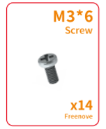

##############################################################################
List
##############################################################################

If you have any concerns, please feel free to contact us via support@freenove.com

ESP32 Car Shield
***********************************

.. table::
    :align: center
    :class: table-line
    
    +----------+----------+
    | Top      | Bottom   |
    |          |          |
    | |List00| | |List01| |
    +----------+----------+

Machinery Parts
***********************************

.. table::
    :align: center
    :class: table-line
    
    +----------+----------+----------+
    | |List02| | |List03| | |List04| |
    +----------+----------+----------+
    | |List05| | |List06| | |List07| |
    +----------+----------+----------+

Transmission Parts
***********************************

.. table::
    :align: center
    :class: table-line
    :width: 80%
    
    +-----------------------------+---------------------------+
    | Servo package x2            | Driven wheel x4           |
    |                             |                           |
    | |List08|                    | |List09|                  |
    +-----------------------------+---------------------------+
    | DC speed reduction motor x4 | Motor bracket package  x4 |
    |                             |                           |
    | |List10|                    | |List11|                  |
    +-----------------------------+---------------------------+

Acrylic Parts
**************************************

Note that there are two kinds of acrylic in the car, and they are very similar to each other, except for a little difference in the head. But they are the same steps on installation.

.. table::
    :align: center
    :class: table-line
    :width: 80%
    
    +--------------+
    | Acrylic List |
    |              |
    | |List12|     |
    +--------------+
    | Acrylic List |
    |              |
    | |List13|     |
    +--------------+

Electronic Parts
**************************************

.. table::
    :align: center
    :class: table-line
    :width: 80%
    
    +-------------------------+----------------------+------------------------------+
    | Line tracking module x1 | Dot Matrix Module x1 | HC-SR04 Ultrasonic Module x1 |
    |                         |                      |                              |
    | |List14|                | |List15|             | |List16|                     |
    |                         |                      +------------------------------+
    |                         |                      | Camera connector x1          |
    |                         |                      |                              |
    |                         |                      | |List17|                     |
    +-------------------------+------------+---------+------------------------------+
    | ESP32 x1                             | Infrared emitter x1                    |
    |                                      |                                        |
    | |List18|                             | |List19|                               |
    +--------------------------------------+----------------------------------------+

.. note::
    
    Although there are two types of camera extensions, they are installed the same way, so the following tutorial will focus on the first one.

Wires
*************************************

.. table::
    :align: center
    :class: table-line
    :width: 80%
    
    +-----------------------+
    | Jumper Wire F/F(4) x1 |
    |                       |
    | |List20|              |
    +-----------------------+
    | FPC Wire x1           |
    |                       |
    | |List21|              |
    +-----------------------+
    | XH-2.54-5Pin cable x1 |
    |                       |
    | |List22|              |
    +-----------------------+

.. |List20| image:: ../_static/imgs/List/List20.png

Tools
**************************************

.. table::
    :align: center
    :class: table-line
    :width: 80%
    
    +----------------------------+---------------+------------------+
    | Cross screwdriver (3mm) x1 | Black tape x1 | Cable Tidy x15cm |
    |                            |               |                  |
    | |List23|                   | |List24|      | |List25|         |
    +----------------------------+---------------+------------------+
 

Required but NOT Contained Parts
**********************************************

.. table::
    :align: center
    :class: table-line text-center
    :width: 60%
    
    +---------------------------------------------------------------------------------------------+
    | 2 x 3.7V 18650 lithium rechargeable batteries with continuous discharge current >3A.        |
    |                                                                                             |
    | It is easier to find proper battery on eBay than Amazon. Search “18650 high drain” on eBay. |
    |                                                                                             |
    | |List26|                                                                                    |
    +---------------------------------------------------------------------------------------------+

