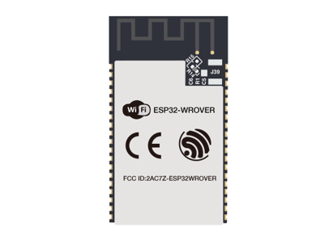
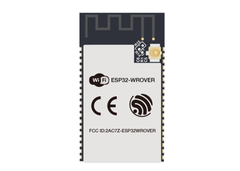
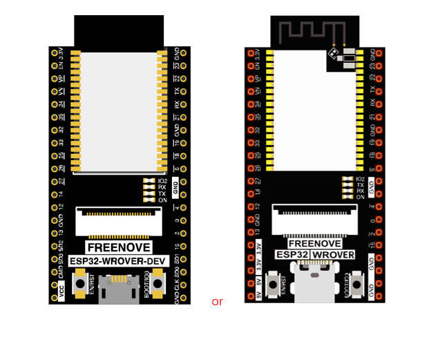
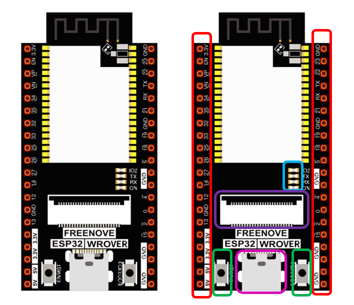
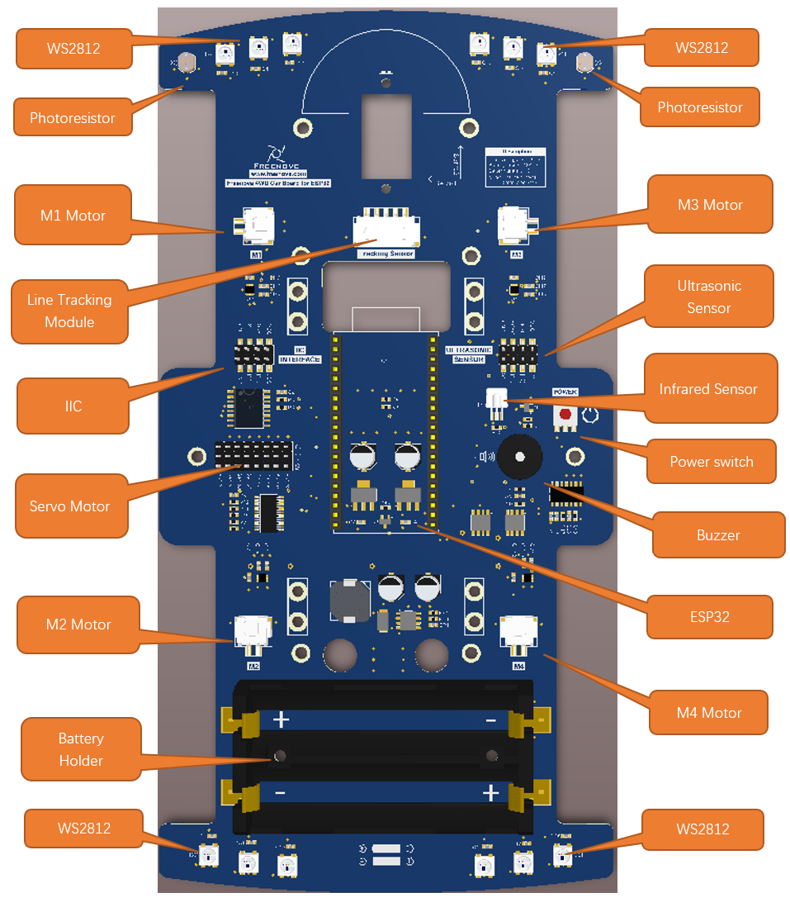

##############################################################################
Preface
##############################################################################

Welcome to use Freenove 4WD Car Kit for ESP32. Following this tutorial, you can make a very cool car with many functions. 

Based on the ESP32 development board, a popular IoT control board, this kit uses the very popular Arduino IDE for programming, so you can share and exchange your experience and design ideas with enthusiasts all over the world. The parts in the kit include all electronic components, modules, and mechanical components required for making the vcar. They are all individually packaged. There are detailed assembly and debugging instructions in this book. If you encounter any problems, please feel free to contact us for fast and free technical support.

support@freenove.com 

This car does not require a high threshold for users. Even if you know little professional knowledge, you can make your own smart car easily with the guidance of the tutorial. If you're really interested in ESP32 and hope to learn how to program and build circuits, please visit our website: www.freenove.com or contact us to buy our kit designed for beginners: :combo:`red font-bolder:Freenove Ultimate Kit for ESP32.`

ESP32
******************************************************************************

ESP32-WROVER has launched a total of two antenna packages, PCB on-board antenna and IPEX antenna respectively. The PCB on-board antenna is an integrated antenna in the chip module itself, so it is convenient to carry and design. The IPEX antenna is a metal antenna derived from the integrated antenna of the chip module itself, which is used to enhance the signal of the module.

.. table::
    :align: center
    :class: table-line
    :width: 80%
    
    +----------------------+--------------+
    | PCB on-board antenna | IPEX antenna |
    |                      |              |
    | |Preface00|          | |Preface01|  |
    +----------------------+--------------+

In this tutorial, the ESP32-WROVER is designed based on PCB on-board antenna packaged ESP32-WROVER module. All projects in this tutorial are based on this board.

.. table::
    :align: center
    :class: table-line
    :width: 80%
    
    +---------------+-----------------------------+-------------+
    | Pins of ESP32 | Funtions                    | Description |
    +===============+=============================+=============+
    | GPIO36        | Camera interface            | CSI_Y6      |
    +---------------+                             +-------------+
    | GPIO39        |                             | CSI_Y7      |
    +---------------+                             +-------------+
    | GPIO34        |                             | CSI_Y8      |
    +---------------+                             +-------------+
    | GPIO35        |                             | CSI_Y9      |
    +---------------+                             +-------------+
    | GPIO25        |                             | CSI_VYSNC   |
    +---------------+                             +-------------+
    | GPIO26        |                             | SIOD        |
    +---------------+                             +-------------+
    | GPIO27        |                             | SIOC        |
    +---------------+                             +-------------+
    | GPIO4         |                             | CSI_Y2      |
    +---------------+                             +-------------+
    | GPIO5         |                             | CSI_Y3      |
    +---------------+                             +-------------+
    | GPIO18        |                             | CSI_Y4      |
    +---------------+                             +-------------+
    | GPIO19        |                             | CSI_Y5      |
    +---------------+                             +-------------+
    | GPIO21        |                             | XCLK        |
    +---------------+                             +-------------+
    | GPIO22        |                             | PCLK        |
    +---------------+                             +-------------+
    | GPIO23        |                             | HREF        |
    +---------------+-----------------------------+-------------+
    | GPIO13        | I2C port                    | SDA         |
    +---------------+                             +-------------+
    | GPIO14        |                             | SCL         |
    +---------------+-----------------------------+-------------+
    | GPIO32        | Battery detection / WS2812  | A6          |
    +---------------+-----------------------------+-------------+
    | GPIO33        | Search light ADC port       | A7          |
    +---------------+-----------------------------+-------------+
    | GPIO12        | Ultrasonic module interface | Trig        |
    +---------------+                             +-------------+
    | GPIO15        |                             | Echo        |
    +---------------+-----------------------------+-------------+
    | GPIO2         | Buzzer port                 | Buzzer      |
    +---------------+-----------------------------+-------------+
    | GPIO0         | Infrared receiver port      | IR          |
    +---------------+-----------------------------+-------------+
    | GPIO1         | Serial port                 | TX          |
    +---------------+                             +-------------+
    | GPIO3         |                             | RX          |
    +---------------+-----------------------------+-------------+

The hardware interfaces of ESP32-WROVER are distributed as follows:

Compare the left and right images. We've boxed off the resources on the ESP32-WROVER in different colors to facilitate your understanding of the ESP32-WROVER.

.. list-table:: 
    :align: center
    :header-rows: 1
    :class: table-line

    * - Box color 
      - **Corresponding resources introduction**
    
    * - |Preface04|
      - **GPIO pin**
    
    * - |Preface05|
      - **LED indicator**
    
    * - |Preface06|
      - **Camera interface**
    
    * - |Preface07|
      - **Reset button, Boot mode selection button **
    
    * - |Preface08|
      - **USB port**

Introduction of the Car
*************************************

The function diagram of the ESP32 car is as follows:

